# موقع «تاج الأصحاء» — النسخة الجديدة

موقع مركز علاج طبيعي وتأهيل طبي في المدينة المنورة، مصمَّم لهدف واحد: **تحويل الزائر إلى حجز**، سواء جاء من البحث أو من حملات سناب شات وتيك توك وميتا وجوجل.

- **هوية من الشعار نفسه**: كحلي `#24475D` وأخضر `#0C8456` وتدرّجهما، والشعار محوَّل إلى SVG بألوانه الأصلية (`public/brand/`) مع نسخة للخلفيات الداكنة وأيقونات المتصفح.
- **تجربة ثلاثية الأبعاد**: عمود فقري يستعيد توازنه ثم يرتفع فوقه شعار المركز مجسّمًا (تاج الورقتين)، ومجسّم تفاعلي «أين يؤلمك؟»، و«مختبر تقنيات»: معرض ثلاثي الأبعاد بصور حقيقية للأجهزة من الشركات المصنّعة (AlterG، والموجات التصادمية BTL، والتيارات مع الشفط BTL، وITO اليابانية، وStimaWELL الألمانية)، مع مزايا كل جهاز ونقاط شرح تفاعلية.
- **موقع متعدد الصفحات**: صفحة لكل برنامج علاجي ولكل جهاز، وصفحات «أين يؤلمك؟» و«من نحن» و«زُر مركزنا» و«الأسئلة» و«احجز تقييمك»، وكل صفحة تنتهي بخطوة حجز واضحة.
- **أيقونات ثلاثية الأبعاد بألوان الشعار** (`public/icons3d/`) للبرامج والوعود والخطوات وطرق التواصل.
- **منظومة Leads متكاملة**: نموذج حجز متعدد الخطوات، وصفحات هبوط لكل حملة، وحفظ مصدر كل طلب (UTM ومعرّفات النقر)، وبكسلات الإعلانات مع Conversions API ومنع التكرار.
- **سرعة**: كل صفحة تُولَّد HTML جاهزًا وقت البناء، ومكتبة 3D لا تُحمَّل إلا عند الحاجة.
- **امتثال**: موافقة صريحة وفق نظام حماية البيانات الشخصية، ولا تُرسَل أي بيانات صحية للمنصات الإعلانية، وتعطيل شهادات المرضى افتراضيًا.
- **لوحة تحكم تجريبية على طريقة ووردبريس** (`/admin`): الحجوزات، والمقالات، ومنشئ الصفحة الرئيسية بمعاينة حية، والبرامج والأجهزة، والمظهر، و18 إضافة، والمستخدمون والأدوار. التفاصيل في [لوحة التحكم التجريبية](#لوحة-التحكم-التجريبية-admin).

> التحليل والبحث الكامل، ومنه تدقيق مباشر للموقعين الحاليين وجدول «قبل/بعد»: [`docs/RESEARCH_AR.md`](docs/RESEARCH_AR.md)

## لقطات

| الواجهة: العمود الفقري يستعيد توازنه ويعلوه شعار المركز مجسّمًا | الجوال |
|---|---|
|  |  |

«أين يؤلمك؟»: مجسّم تفاعلي

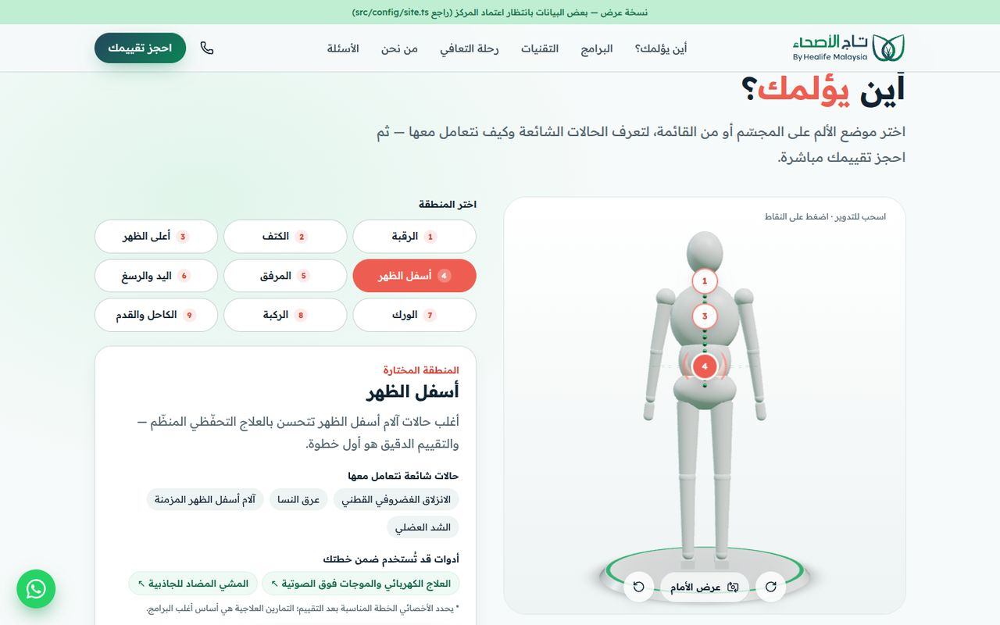

| «مختبر التقنيات»: معرض ثلاثي الأبعاد بصور الأجهزة الحقيقية ومزايا كل جهاز | على الجوال: اسحب لتبديل الجهاز، والنقاط تفتح شرحًا أسفل المشهد |
|---|---|
| 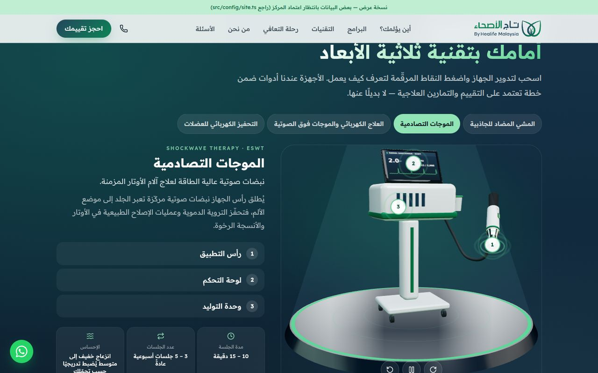 | 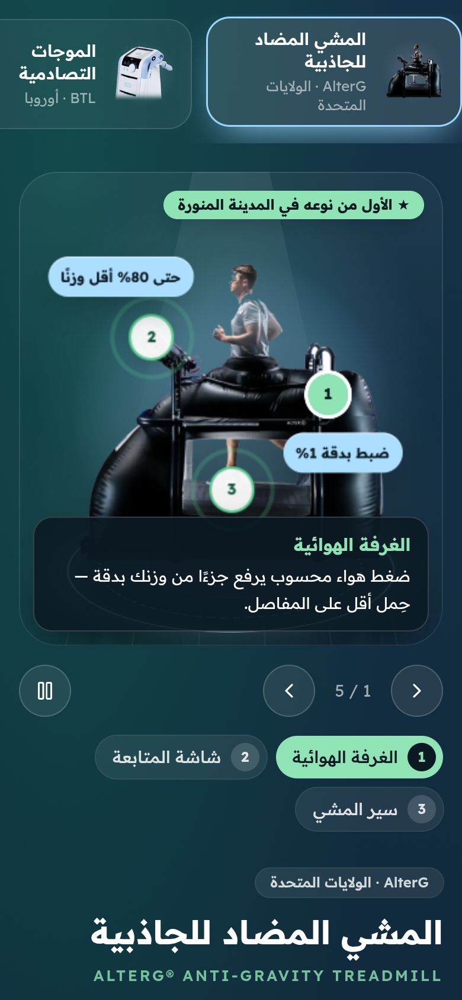 |

صفحة برنامج (آلام الظهر والرقبة): لمن هو، وماذا يحدث معك خطوة بخطوة، والأجهزة المرتبطة، وأسئلته، والحجز:

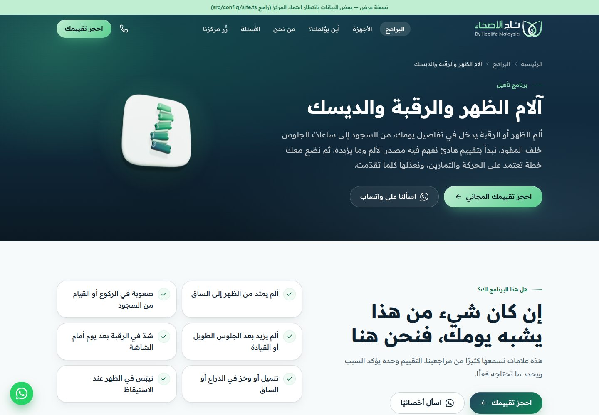

| شرح أجزاء الجهاز: طبقة فوق المشهد لا تغطيها أي أيقونة، والجهاز يثبت أثناء القراءة | «من أين تبدأ؟» على الجوال بأيقونات ثلاثية الأبعاد |
|---|---|
| 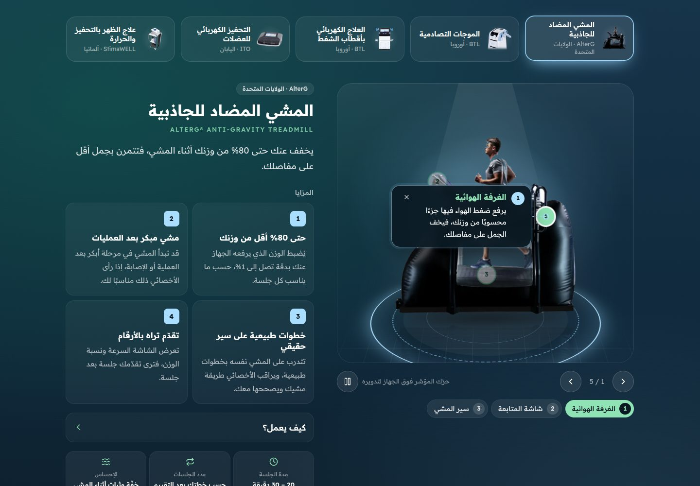 | 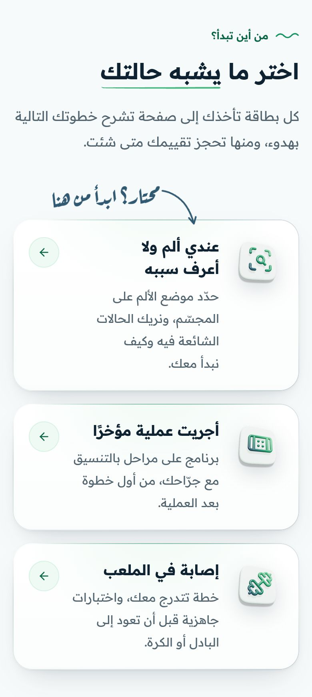 |

الأيقونات ثلاثية الأبعاد بألوان الشعار (`public/icons3d/`، وتُولَّد بـ `scripts/icons3d/`):

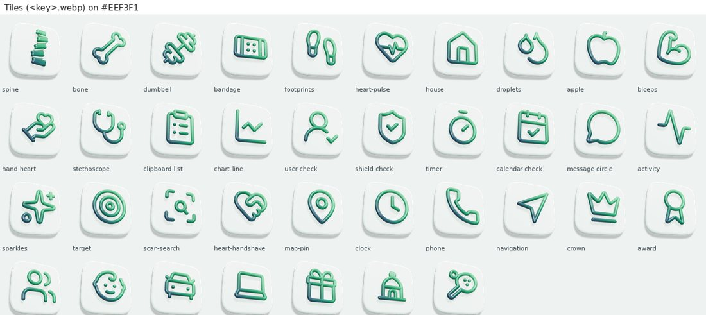

«زُر مركزنا»: صور حقيقية للمركز، والعنوان وساعات العمل ورابط الاتجاهات من قائمته في خرائط Google:

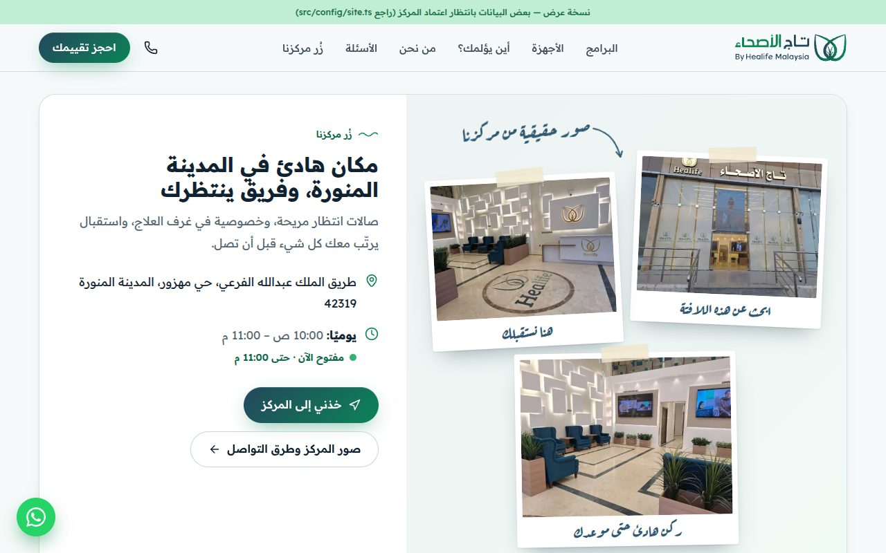

صفحة هبوط حملة (AlterG) على الجوال — النموذج أعلى الصفحة والحالة مختارة مسبقًا:


الهوية البصرية المأخوذة من الشعار:


---

## لوحة التحكم التجريبية (`/admin`)

نسخة عرض لإدارة المركز من لوحة تحكم على طريقة ووردبريس. تعمل داخل المتصفح دون خادم: ما تعدّله يظهر في الموقع فورًا **في المتصفح نفسه**، ولا يراه غيرك.

**الدخول:** افتح `/admin` واختر حسابًا (إدارة المركز، أو فريق المحتوى، أو الاستقبال، أو التسويق). كلمة المرور `demo`. حساب الإدارة عليه تحقق بخطوتين: الرمز `246810`، أو زر «املأه عني».

| القسم | ما يفعله |
|---|---|
| لوحة المعلومات | طلبات الأسبوع، ونسبة ما صار مواعيد، ومتوسط زمن أول رد مقابل وعد الـ 15 دقيقة، ومصادر الطلبات، ومواعيد اليوم، وصحة الموقع |
| الحجوزات | قائمة، ولوحة متابعة بالسحب والإفلات، وتقويم، وملف لكل طلب (الحالة والموعد والملاحظات ومصدر الإعلان)، وتصدير Excel، وإضافة طلب من مكالمة. الحجز من الموقع يصل هنا |
| المقالات | محرر بالكتل (فقرة، وعنوان، وقائمة، واقتباس، وتنبيه، وصورة، وزر حجز)، ومسودات ومعاينة، وتحليل SEO على طريقة Yoast. صفحة `/blog` تظهر مع أول مقال منشور |
| الوسائط | رفع الصور وضغطها إلى WebP، والنص البديل، ومنتقي الصور |
| الصفحات | منشئ الرئيسية: ترتيب الأقسام بالسحب، وإخفاؤها، وتعديل نصوصها، مع معاينة حية للحاسوب والجوال |
| البرامج والأجهزة والأسئلة | تحرير كل برنامج وجهاز وسؤال، ومنه رقم إذن التسويق (MDMA) لكل جهاز |
| المظهر والقوائم | ألوان جاهزة أو مخصصة، واستدارة البطاقات، وروابط القائمة الرئيسية |
| الإضافات | 18 إضافة مثبتة: تحسين البحث، والنماذج، والمواعيد، وواتساب، والتحليلات، والأمان، والنسخ الاحتياطي، والتخزين المؤقت، والصور، والتحويلات، والنوافذ والعروض، وآراء المراجعين، والخصوصية، ووضع الصيانة، وتعدد اللغات، والبريد، ومكافحة الرسائل المزعجة، وسجل النشاط. و7 أخرى في «أضف إضافة». لكل إضافة إعداداتها وأثرها في الموقع |
| المستخدمون | أربعة أدوار بصلاحيات مختلفة، والتحقق بخطوتين |
| الأدوات | صحة الموقع (فحص حي للمحتوى والإعدادات والامتثال)، والنسخ الاحتياطي والاستعادة، وسجل النشاط، والتصدير والاستيراد |
| الأمان والأداء والتحويلات | فحص حقيقي لرؤوس الأمان، وقياس حي لزمن تحميل الصفحات، وتحويلات 301 و302، وسجل الروابط المكسورة |

| لوحة المعلومات | لوحة متابعة الحجوزات |
|---|---|
| 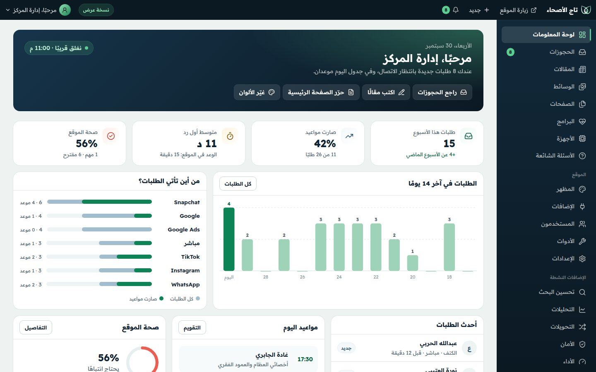 | 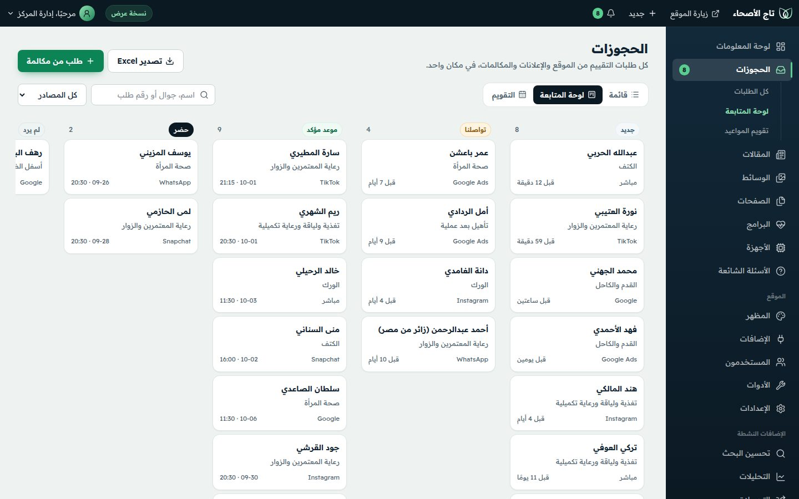 |
| **منشئ الرئيسية بمعاينة حية** | **محرر المقالات** |
| 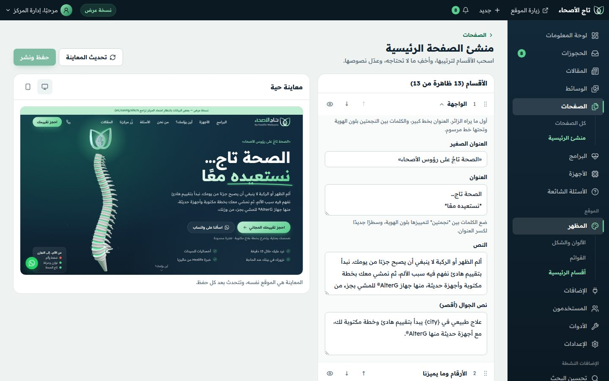 | 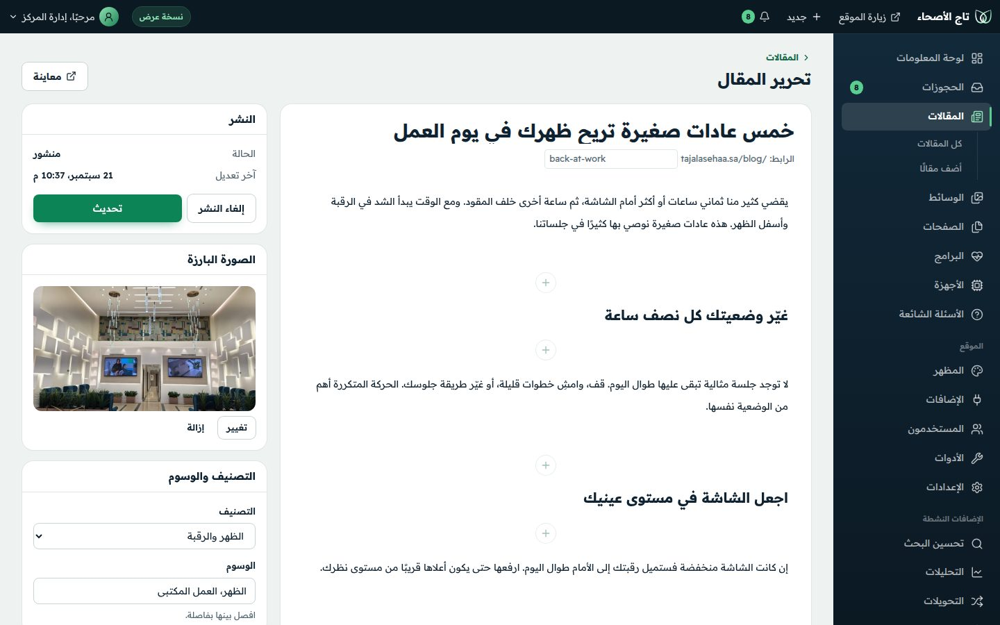 |
| **الإضافات** | **صحة الموقع** |
| 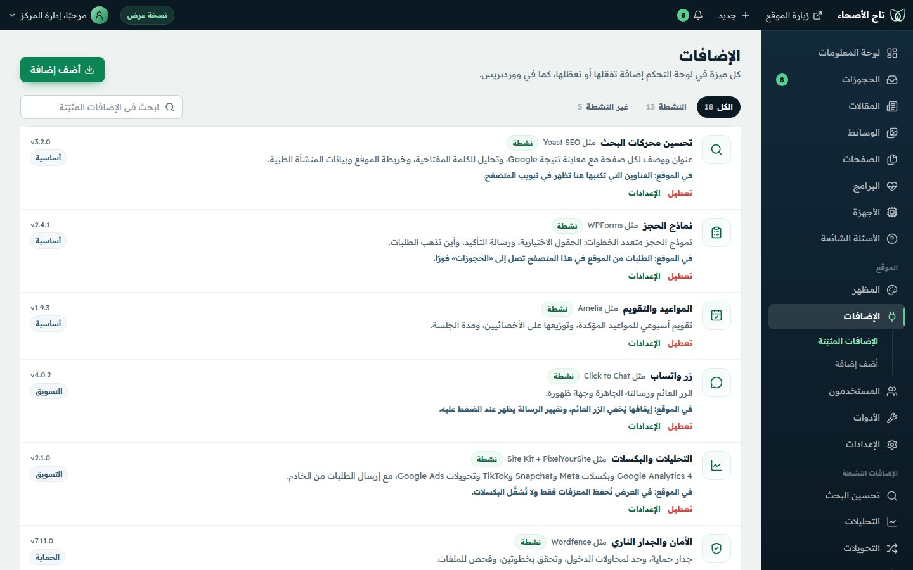 | 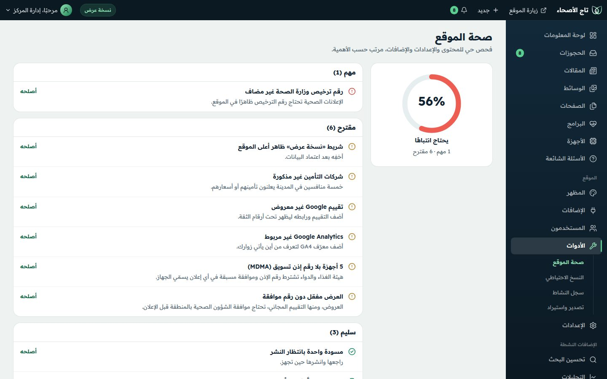 |
| **تسجيل الدخول** | **على الجوال** |
| 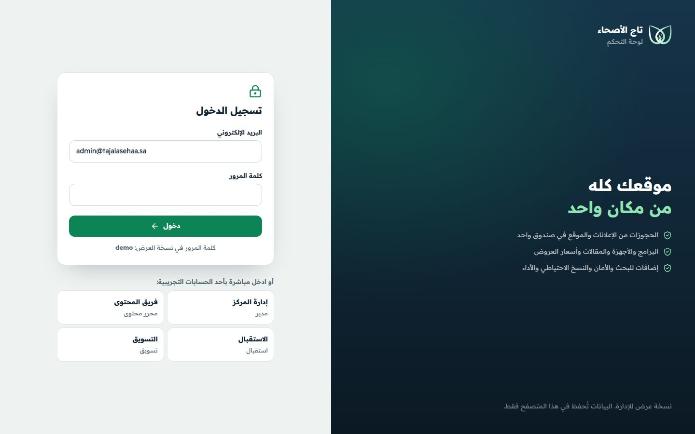 | 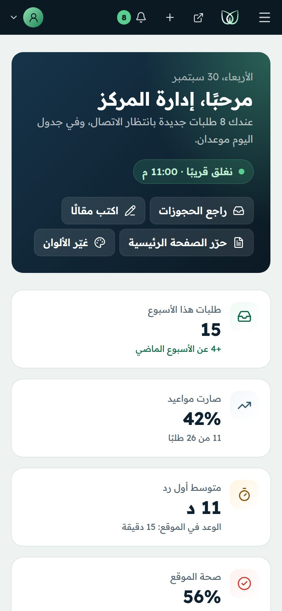 |

**حدود نسخة العرض:**
- البيانات في `localStorage` (المفتاح `taj_cms_v1`) والصور المرفوعة في IndexedDB، في هذا المتصفح فقط. «إعادة الضبط» في الأدوات تعيدها كما كانت.
- الطلبات التجريبية (26 طلبًا) بأسماء وهمية، وأزرار الاتصال وواتساب معطّلة فيها.
- كلمة المرور ورمز التحقق ثابتان للعرض.
- زائر لم يفتح اللوحة يرى الموقع المولَّد كما هو، فلا تؤثر اللوحة في سرعته.

**للتشغيل الفعلي:** تُنقل الحالة إلى قاعدة بيانات مع دخول حقيقي (Supabase مثلًا، أو ووردبريس أو Strapi بلا واجهة)، وتصل الطلبات عبر `api/lead.ts` الموجود، ويعيد الحفظ بناء الموقع. البنية جاهزة لذلك: الموقع يقرأ محتواه من `src/config`، واللوحة تطبّق تعديلاتها عبر `src/cms/apply.ts`.

## التشغيل محليًا

```bash
cd tajalasehaa
npm install
npm run dev          # بيئة التطوير على http://localhost:5173
npm run build        # بناء الإنتاج + توليد الصفحات الثابتة في dist/
npm run preview      # معاينة نسخة الإنتاج
npm run typecheck    # فحص الأنواع
npm run check:content  # قائمة البيانات التي تحتاج اعتماد المركز قبل النشر
```

يتطلب Node.js 20 أو أحدث.

## صفحات الموقع

| الرابط | المحتوى |
|---|---|
| `/` | نظرة عامة: «من أين تبدأ؟»، «أين يؤلمك؟»، البرامج، معرض الأجهزة المختصر، رحلة التعافي، الزيارة، الأسئلة، الحجز |
| `/programs` و`/programs/<id>` | البرامج، وصفحة لكل برنامج: لمن هو، وماذا يحدث معك، والأجهزة المرتبطة، وأسئلته |
| `/devices` و`/devices/<id>` | معرض الأجهزة كاملًا، ويفتح على الجهاز المطلوب ويحدّث الرابط عند التبديل |
| `/conditions` | المجسّم التفاعلي وفهرس الحالات حسب المنطقة |
| `/about` | القصة والفريق والوعود ورحلة التعافي |
| `/visit` | صور المركز والعنوان والاتجاهات وأوقات العمل وطرق التواصل والتأمين |
| `/faq` | الأسئلة العامة وأسئلة كل برنامج |
| `/book` | نموذج الحجز أعلى الصفحة (`?c=knee` يختار سبب الزيارة مسبقًا) |

كل الصفحات مولَّدة مسبقًا بعنوان ووصف خاصين، وبيانات منظَّمة (`BreadcrumbList`، و`FAQPage` للأسئلة، و`MedicalClinic`)، وتدخل في `sitemap.xml`.

## أين أعدّل المحتوى؟

كل البيانات في مجلد `src/config` — لا حاجة للمس المكوّنات:

| الملف | المحتوى |
|---|---|
| `site.ts` | الاسم، الهاتف، واتساب، البريد، الحسابات، الفروع، أوقات العمل، الترخيص، التأمين، الأرقام، العرض الحالي، معرّفات البكسلات |
| `content.ts` | البرامج العلاجية وصفحاتها (المقدمة، العلامات، الخطوات، الأجهزة، الأسئلة، SEO)، «لحظات الحياة»، رحلة التعافي، الالتزامات، الفريق، الأسئلة الشائعة |
| `devices.ts` | أجهزة مختبر التقنيات: المزايا، والأرقام العائمة، والنقاط التفاعلية، والصور ومصادرها |
| `body.ts` | مناطق «أين يؤلمك؟» والحالات المرتبطة بها |
| `campaigns.ts` | صفحات هبوط الحملات |
| `booking.ts` | خيارات نموذج الحجز |

**الهوية:** الألوان في `src/theme.css` (كتلة `@theme`، يشترك فيها الموقع ولوحة التحكم)، وملفات الشعار في `public/brand/` (`logo*.svg` للترويسة والتذييل، `mark*.svg` للرمز وحده، `logo.png` للبيانات المنظَّمة)، والأيقونات `public/favicon.*` و`public/apple-touch-icon.png`. المكوّنان `Logo` و`BrandMark` في `src/components/ui/Logo.tsx`.

**صور الأجهزة:** في `public/devices/` بخلفية شفافة (`<id>-<width>.webp`) ومصغّرة لشريط الاختيار (`<id>-thumb.webp`)، وتُعرَّف في `image` لكل جهاز داخل `devices.ts` (مع `aspect` نسبة العرض إلى الارتفاع و`fit` للحجم على المنصة). مواضع النقاط المرقّمة والأرقام العائمة نِسَب مئوية من الصورة (`x`, `y`). الصور الحالية رسمية من الشركات المصنّعة للتوضيح، والمصدر مذكور تحت كل جهاز؛ الأفضل استبدالها بصور أجهزة المركز نفسها بعد إزالة الخلفية.

**الصور:** صور المركز الحقيقية في `public/photos/` بثلاثة مقاسات (`<id>-480|960|1440.webp`)، وتُعرَّف في `centerPhotos` داخل `src/config/content.ts`. لإضافة صورة: ضع ملفاتها بالمقاسات نفسها وأضف سطرًا بالوصف والتعليق. لا تستخدم صورًا تُظهر مرضى.

⚠️ القيم المعلَّمة بـ «تحقق» جُمعت من الموقع الحالي ونتائج البحث عنه، ويجب اعتمادها من إدارة المركز. بعد مراجعتها اجعل `isDemo: false` في `site.ts` ليختفي شريط «نسخة عرض»، ثم شغّل `npm run check:content`.

## صفحات الحملات

كل حملة لها صفحة مستقلة بلا قائمة تنقّل، وعنوان يطابق رسالة الإعلان، ونموذج حجز سريع أعلى الصفحة:

| الرابط | الزاوية |
|---|---|
| `/lp/back-pain` | آلام الظهر والديسك |
| `/lp/knee` | خشونة وإصابات الركبة |
| `/lp/alterg` | جهاز AlterG المضاد للجاذبية |
| `/lp/shockwave` | الموجات التصادمية (الشوك العظمي ومرفق التنس) |
| `/lp/home` | العلاج الطبيعي المنزلي |
| `/lp/umrah` | برنامج المعتمرين والزوار |
| `/lp/women` | صحة المرأة |

أضف دائمًا معاملات UTM لرابط الإعلان، مثال:

```
https://tajalasehaa.sa/lp/back-pain?utm_source=snapchat&utm_medium=paid&utm_campaign=backpain-2026-10&utm_content=video-a
```

يحفظ الموقع تلقائيًا `utm_*` ومعرّفات النقر (`fbclid`، `gclid`، `gbraid`، `wbraid`، `ttclid`، `ScCid`) مع كل طلب، أول زيارة وآخر زيارة، لمدة 90 يومًا.

## استقبال الطلبات (Leads)

نموذج الحجز يرسل إلى `api/lead.ts` (دالة Vercel)، التي:

1. تتحقق من البيانات وتصفّي الرسائل المزعجة (حقل فخ + توقيت).
2. ترسل الطلب إلى `LEAD_WEBHOOK_URL`: Google Sheets أو Make أو Zapier أو n8n أو نظام CRM.
3. ترسل حدث التحويل من الخادم لـ Meta وSnap وTikTok (إن فُعّلت) بنفس `event_id` المستخدم في البكسل لمنع التكرار.

إن لم يكن هناك مستقبِل، أو فشل الإرسال، يعرض الموقع للزائر زر «أكمل طلبك عبر واتساب» برسالة جاهزة، فلا يضيع أي طلب.

### أسرع إعداد: Google Sheets (مجاني)

1. أنشئ Google Sheet ← Extensions ← Apps Script ← الصق محتوى [`integrations/google-sheets-webhook.gs`](integrations/google-sheets-webhook.gs).
2. غيّر `SECRET` وضع بريد التنبيه في `NOTIFY_EMAIL`.
3. Deploy ← Web app (Execute as: Me — Who has access: Anyone) ← انسخ الرابط.
4. في Vercel ← Settings ← Environment Variables أضف `LEAD_WEBHOOK_URL` و`LEAD_WEBHOOK_SECRET`.

يضيف الملف أعمدة للفريق («حالة المتابعة»، «حجز مؤكد؟»، «حضر؟») لقياس جودة كل حملة، لا عدد الطلبات فقط.

### متغيرات البيئة

| المتغير | الغرض |
|---|---|
| `LEAD_WEBHOOK_URL` | **مطلوب** — عنوان استقبال الطلبات |
| `LEAD_WEBHOOK_SECRET` | كلمة سر تُرسل مع كل طلب للتحقق |
| `ALLOWED_ORIGINS` | اختياري: نطاقات مسموح لها بالإرسال، مثل `https://tajalasehaa.sa` |
| `META_PIXEL_ID`، `META_CAPI_TOKEN` | Meta Conversions API (حدث `Lead`) |
| `META_TEST_EVENT_CODE`، `META_GRAPH_VERSION` | اختبار الأحداث / إصدار الواجهة (افتراضي v24.0) |
| `SNAP_PIXEL_ID`، `SNAP_CAPI_TOKEN` | Snap Conversions API (حدث `SIGN_UP`) — اختبره بأداة Snap قبل الاعتماد |
| `TIKTOK_PIXEL_ID`، `TIKTOK_ACCESS_TOKEN`، `TIKTOK_TEST_EVENT_CODE` | TikTok Events API (حدث `Lead`) |

## التتبع والبكسلات

ضع المعرّفات في `site.tracking` داخل `src/config/site.ts`، ويُحمّل كل بكسل تلقائيًا عند وجود معرّفه:

| الحدث في الموقع | Meta | Snap | TikTok | Google |
|---|---|---|---|---|
| إرسال نموذج الحجز | `Lead` | `SIGN_UP` | `Lead` | `generate_lead` + تحويل Ads |
| نقرة واتساب / اتصال | `Contact` | `CUSTOM_EVENT_1` | `Contact` | `contact_whatsapp` / `contact_call` |
| مشاهدة صفحة | `PageView` | `PAGE_VIEW` | `page()` | `page_view` |

- **لا تُرسل بيانات صحية للمنصات الإعلانية** (نوع الشكوى أو الجهاز يبقى في نظامنا وGA4 فقط).
- رقم الجوال المشفّر (SHA-256) لا يُرسل من الخادم إلا إذا وافق الزائر على الموافقة التسويقية الاختيارية.
- صفحة `/thank-you` تصلح كصفحة تحويل، لكن اعتمد الأحداث (Lead) لا عنوان الصفحة لتجنّب الاحتساب المزدوج.

## النشر على Vercel

1. New Project ← اختر هذا المستودع.
2. **Root Directory**: `tajalasehaa`.
3. Framework: Vite (الإعدادات في `vercel.json` جاهزة).
4. أضف متغيرات البيئة أعلاه ثم Deploy.
5. اربط النطاق `tajalasehaa.sa`، ووجّه النطاق المكرر `tajalasehaa.site` بتحويل 301 إلى النطاق الأساسي.

## البنية التقنية

```
tajalasehaa/
├── api/lead.ts                 # استقبال الطلبات + Conversions APIs
├── integrations/               # Google Apps Script لاستقبال الطلبات في Sheets
├── scripts/prerender.mjs       # توليد HTML ثابت لكل صفحة + sitemap + robots
├── scripts/check-content.mjs   # فحص البيانات قبل النشر
├── public/                     # favicon + صورة المشاركة og.jpg
└── src/
    ├── config/                 # كل المحتوى والبيانات
    ├── cms/                    # بيانات لوحة التحكم وتخزينها وتطبيقها على الموقع
    ├── admin/                  # واجهة لوحة التحكم (حزمة منفصلة لا تُحمّل مع الموقع)
    ├── components/             # الأقسام، الحجز، الترويسة، التذييل
    ├── three/                  # المشاهد ثلاثية الأبعاد (تُحمّل عند الحاجة)
    ├── lib/                    # التتبع، المصادر، الطلبات، الهاتف
    └── pages/                  # الرئيسية، صفحات الحملات، الشكر، الخصوصية
```

React 19 + Vite 8 + Tailwind CSS 4 + React Three Fiber / drei (three.js).

### الأداء والوصول

- JavaScript الأساسي ≈ 133KB (مضغوط، ويشمل كل الصفحات فالتنقل بينها فوري)، وحزمة three.js منفصلة (≈ 252KB) تُحمّل عند اقتراب المشهد فقط.
- معرض الأجهزة بـ CSS 3D دون WebGL: يعمل على كل الجوالات، ولا يُحمّل إلا صورة الجهاز الظاهر وجاريه (≈ 20–90KB للصورة).
- كل الصفحات مولَّدة مسبقًا (Prerender): المحتوى والعنوان والوصف وبيانات Schema جاهزة لمحركات البحث.
- المشاهد تتوقف عند الخروج من الشاشة، وتخفّض الدقة تلقائيًا على الأجهزة الضعيفة، وتحترم «تقليل الحركة».
- بديل ثابت (SVG) عند عدم توفر WebGL، وأزرار تدوير وإيقاف للحركة، وقوائم نصية مكافئة لكل نقطة تفاعلية.

## قبل الإطلاق

- [ ] اعتماد كل البيانات المعلّمة «تحقق» (`npm run check:content`).
- [ ] رقم ترخيص وزارة الصحة، والمسميات المهنية للأخصائيين كما في تصنيف الهيئة السعودية للتخصصات الصحية.
- [ ] موافقة الشؤون الصحية على العروض والخصومات والأسعار المعلنة، ومنها التقييم المجاني (حقل رقم الموافقة في الإعدادات).
- [ ] أرقام إذن التسويق (MDMA) للأجهزة، وملف إثبات AlterG (الفاتورة وتاريخ التركيب والطراز). انظر القسم 2.6 في البحث.
- [ ] مراجعة نظامية لسياسة الخصوصية (`/privacy`).
- [ ] صور حقيقية للمركز والفريق (بدل الصور العامة) وشعار المركز الرسمي.
- [x] طرازات الأجهزة (أكّدتها الإدارة). الصور من الشركات المصنّعة مع ذكر مصدرها، ويُفضَّل لاحقًا تصوير أجهزة المركز نفسها.
- [ ] ضبط `LEAD_WEBHOOK_URL` واختبار طلب حقيقي من الجوال.
- [ ] تفعيل البكسلات وConversions API واختبار الأحداث من أدوات كل منصة.
- [ ] جعل `isDemo: false`.
