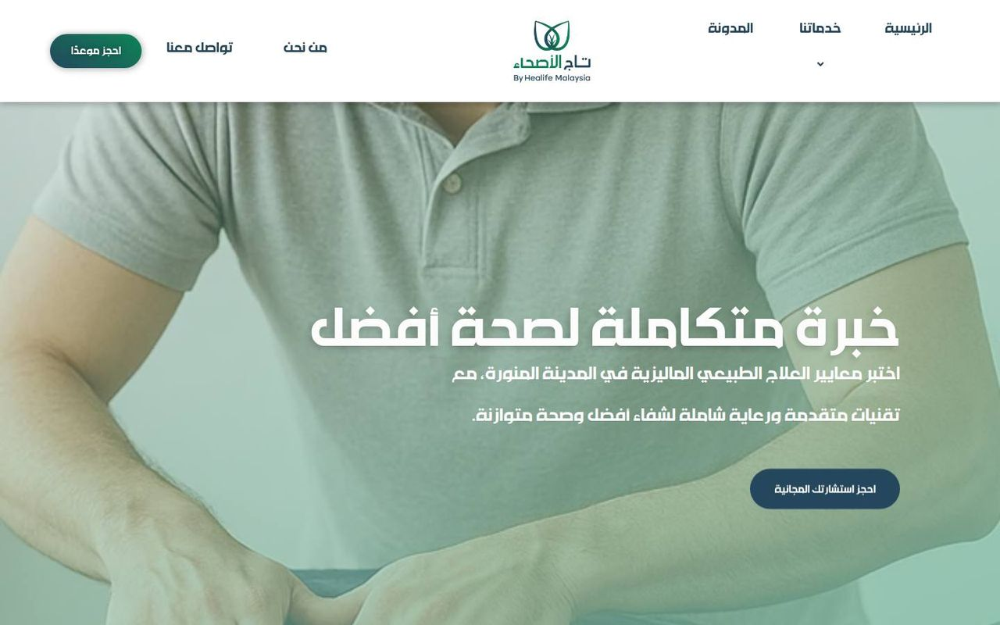
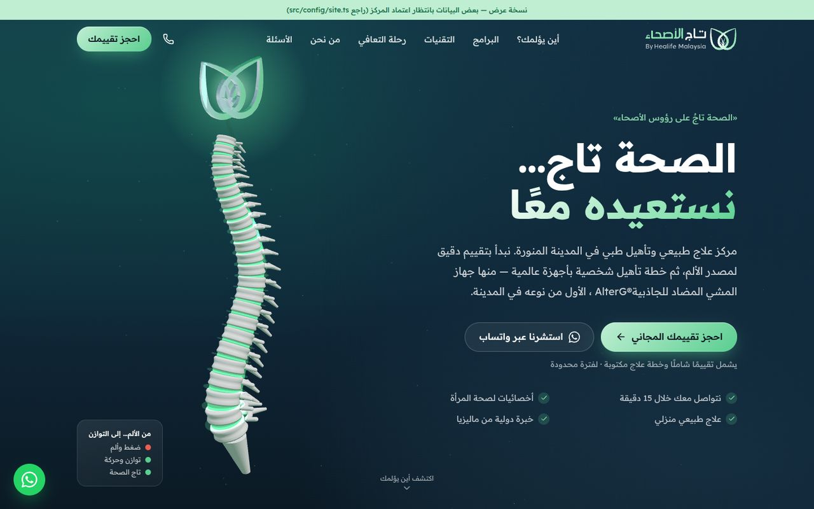
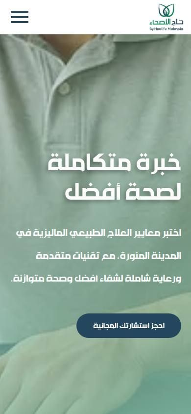
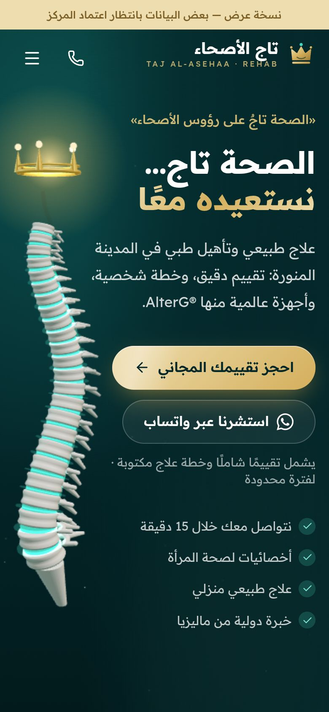
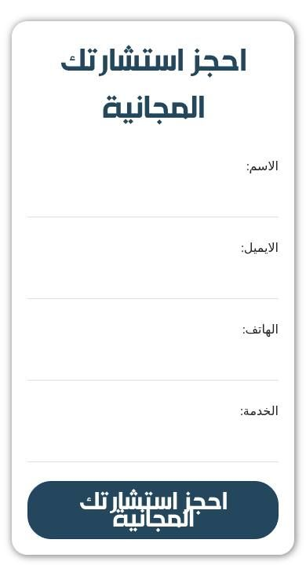
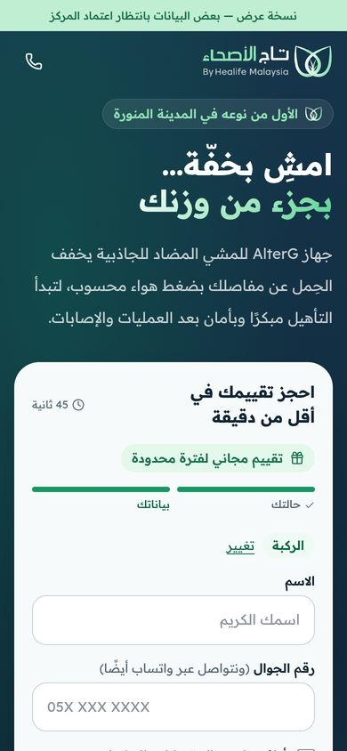
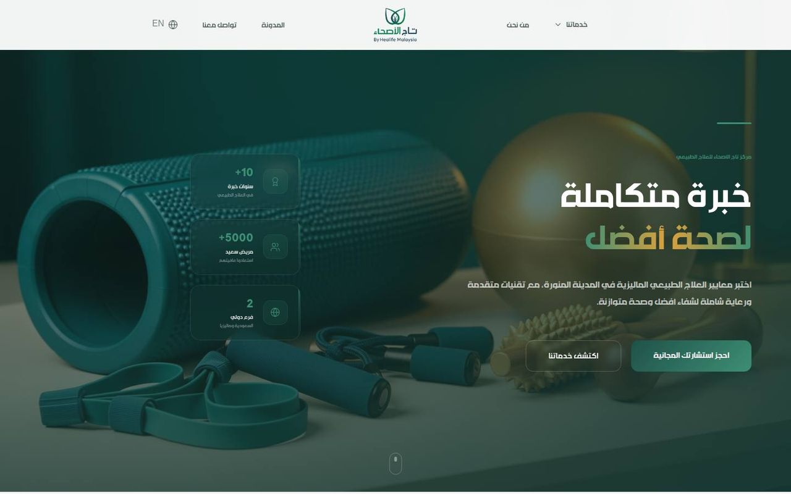
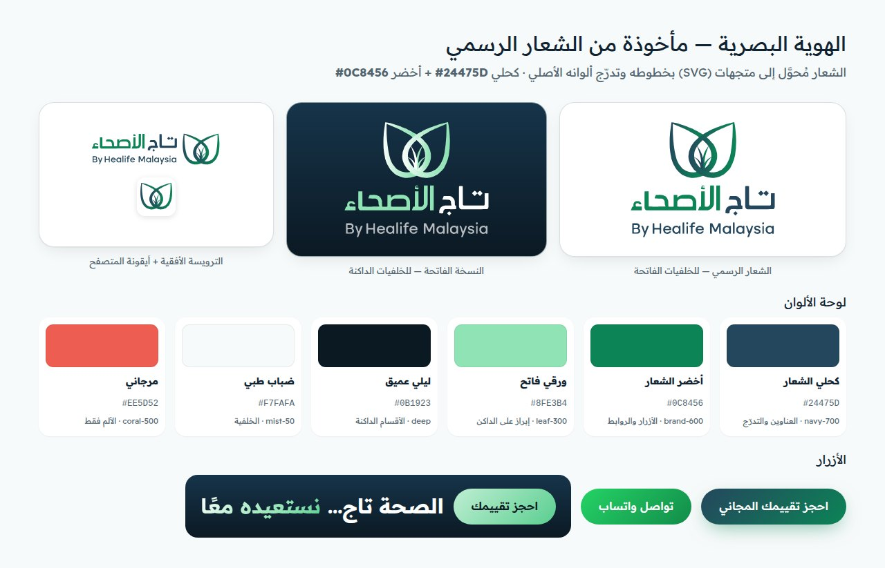

# تاج الأصحاء: تحليل الموقع الحالي وخطة بناء موقع يحوّل الزوار إلى حجوزات

> إعداد: سبتمبر 2026 · يرافق هذا التقرير النسخة الجديدة من الموقع في مجلد `tajalasehaa/`.
> **تحديث 30 سبتمبر 2026:** تدقيق مباشر للموقعين الحاليين بمتصفح حقيقي (القسم 1)، وهوية بصرية مأخوذة من الشعار الرسمي (القسم 3.4)، وعنوان المركز وساعاته وصوره الحقيقية من قائمته في خرائط Google (القسم 3.5).
> كل معلومة واقعية مرفقة بمصدرها، وما لم نتمكن من التحقق منه معلَّم بـ **[غير مؤكد]**.

---

## الملخص التنفيذي

1. **من هو المركز فعلًا؟** الموقع `tajalasehaa.sa` يعود إلى **«تاج الأصحاء» (Taj Al-Asehaa)** في **المدينة المنورة**، الفرع السعودي لمجموعة **Healife (هي لايف) الماليزية**. يقدّم علاجًا طبيعيًا وتأهيلًا، إلى جانب خدمات تكميلية (حجامة، تصريف لمفاوي، تغذية، نحت جسم). يملك جهازًا نادرًا هو **AlterG المضاد للجاذبية**، ويعلن أنه الأول من نوعه في المدينة.
2. **ماذا وجد التدقيق المباشر للموقع الحالي؟**
   - **النموذج يطمس بيانات العميل:** حقل «الخدمة» يحمل الاسم البرمجي نفسه لحقل «الاسم»، والجوال اختياري بينما البريد إلزامي.
   - **لا واتساب في أي صفحة، وأزرار الاتصال معطوبة:** `+9660573998384` بصفر زائد، و`tel:+966` بلا رقم في نسخة `.site`.
   - **الحملات بلا قياس:** حاوية Google Tag Manager منشورة لكنها فارغة، ولا بكسل Meta أو Snap أو TikTok ولا تحويل Google Ads.
   - **بطء شديد:** يظهر المحتوى الرئيسي بعد **16.3 ثانية** على جوال بشبكة بطيئة (211 طلبًا و4.5MB)، مقابل **2.1 ثانية** للنسخة الجديدة بالظروف نفسها.
   - **على الجوال** يمتد عرض الصفحة إلى 10,389px بدل 390px بسبب رابط مخفي بطريقة لا تناسب الصفحات العربية.
   - **رسائل تهدم الثقة في الرئيسية:** نص عن «حلول عقارية وتطويرية» منسوخ من قالب آخر، وعنوان وهاتف وخريطة فرع كوالالمبور، ومراجعات Google لفرع ماليزيا معظمها عن الحجامة.
   - **SEO ضعيف:** 4 صفحات بعنوان ووصف مكررين، وصفحة AlterG بلا عنوان H1، و70% من الصور بلا نص بديل، ونطاق مكرر `tajalasehaa.site`.
3. **الفكرة الكبرى للنسخة الجديدة:** اسم المركز مأخوذ من المثل **«الصحة تاج على رؤوس الأصحاء لا يراه إلا المرضى»**، فبنينا الهوية حوله: **«الصحة تاج… نستعيده معًا»**. في الواجهة عمود فقري ثلاثي الأبعاد ينتقل من الألم إلى التوازن، ثم يرتفع فوقه **شعار المركز نفسه مجسّمًا**: تاج الورقتين والبرعم.
   - **الهوية مأخوذة من الشعار:** كحلي `#24475D` وأخضر `#0C8456` وتدرّجهما. حوّلنا الشعار إلى SVG بخطوطه وتدرّج ألوانه الأصلي، مع نسخة للخلفيات الداكنة وأيقونات المتصفح. النسخة المحوّلة **معتمدة مؤقتًا** حتى يتوفر الملف الأصلي.
   - **بيانات حقيقية من خرائط Google:** العنوان والإحداثيات ورابطا الخريطة والاتجاهات وساعات العمل، وقسم «زُر مركزنا» بصور حقيقية للمركز بدل الصور الجاهزة.
4. **ما يجعله مختلفًا عن المنافسين:**
   - **مجسّم «أين يؤلمك؟»** ثلاثي الأبعاد يبدأ من الجسم لا من قائمة الخدمات.
   - **«مختبر تقنيات»**: معرض ثلاثي الأبعاد بصور حقيقية عالية الدقة لأجهزة المركز ومزايا كل جهاز، بصدق علمي: أدوات داخل خطة وليست «علاجًا سحريًا».
   - رسائل مرتبطة بحياة الزائر في المدينة: الصلاة، والمشي إلى المسجد النبوي، وبرنامج المعتمرين.
5. **آلة تحويل كاملة:**
   - 7 صفحات هبوط للحملات، ونموذج حجز من خطوات.
   - حفظ مصدر كل طلب (UTM ومعرّفات النقر).
   - بكسلات Meta وSnap وTikTok وGoogle، مع Conversions API ومنع الاحتساب المزدوج.
   - بديل واتساب تلقائي حتى لا يضيع أي طلب.
   - صفحة هبوط تظهر خلال **~2 ثانية** على جوال بشبكة بطيئة.
6. **الامتثال أولًا:** الإعلان الصحي في المملكة منظَّم بصرامة، وتصل العقوبات إلى 10 ملايين ريال. لذلك:
   - صغنا المحتوى بلا وعود بالشفاء.
   - عطّلنا شهادات المرضى افتراضيًا.
   - طبّقنا الموافقة الصريحة وفق نظام حماية البيانات الشخصية.
   - لا نرسل أي بيانات صحية للمنصات الإعلانية.

---

## 1. تحليل النسخة الحالية (tajalasehaa.sa وtajalasehaa.site)

### 1.1 المنهجية

في 30 سبتمبر 2026 أصبح الوصول المباشر متاحًا، فدقّقنا الموقعين بمتصفح حقيقي (Chromium):

- **`tajalasehaa.sa`** (ووردبريس + Elementor + قالب Vireon + Rank Math):
  - زحفنا على كل روابط خريطة الموقع (18 رابطًا: 16 صفحة ومقالان).
  - فحصنا الرئيسية وصفحة الحجز على الحاسوب (1440px) والجوال (390px).
- **`tajalasehaa.site`** (نسخة مبنية بـ Lovable): الرئيسية بالعربية والإنجليزية.
- قرأنا ملف حاوية Google Tag Manager العلني لمعرفة الوسوم المنشورة، وحلّلنا شيفرة النماذج **دون إرسال أي طلب تجريبي**.
- قسنا السرعة للمواقع الثلاثة (القديمان والجديد) بظروف موحّدة: شبكة جوال بطيئة 1.6Mbps بزمن 150ms، ومعالج أبطأ 4×، وذاكرة تخزين فارغة. القياس من خادم سحابي، فالأرقام للمقارنة لا مطلقة.
- ملاحظة: خادم `.sa` يعرض صفحة «فحص المتصفح» (رمز 403) لأي عميل ليس متصفحًا؛ دخلنا كزائر عادي.

### 1.2 النتيجة في جدول واحد

| المعيار | `tajalasehaa.sa` (الحالي) | `tajalasehaa.site` (Lovable) | النسخة الجديدة |
|---|---|---|---|
| ظهور المحتوى الرئيسي (LCP) بظروف الجوال الموحّدة | **16.3 ثانية** (أول رسم 5.8) | 3.8 ثانية | **2.1 ثانية** للرئيسية · 2.2 لصفحة الحملة |
| حجم الرئيسية وعدد الطلبات | ≈4.5MB · 211 طلبًا · 91 ملف سكربت | ≈0.6MB · 29 طلبًا | ≈0.5MB مع المشاهد ثلاثية الأبعاد · 14 طلبًا (صفحة الحملة 0.22MB · 10 طلبات) |
| HTML الصفحة | 1.07MB | 1.9KB فارغ (المحتوى يُبنى بالجافاسكربت) | 139KB محتوى جاهز مولَّد مسبقًا |
| عرض الصفحة على الجوال | **10,389px** بدل 390px (تمرير أفقي) | سليم | سليم |
| واتساب | **لا يوجد أي رابط** في الصفحات الـ 18 | لا يوجد | في كل قسم + شريط ثابت + بديل تلقائي عند تعذّر الإرسال |
| زر الاتصال | `tel:+9660573998384` (صفر زائد) | `tel:+966` **بلا رقم** | `tel:+966573998384` من مصدر واحد |
| نموذج الحجز | 4 حقول: البريد إلزامي والجوال **اختياري**، وحقل «الخدمة» يطمس حقل «الاسم» | 3 حقول، والبريد إلزامي | خطوات بنقرة، والجوال فقط، وموافقة صريحة |
| التتبع | GA4 فقط (عبر Site Kit)، وحاوية GTM **فارغة**، ولا Meta ولا Snap ولا TikTok ولا Google Ads | لا شيء | GA4 + Meta + Snap + TikTok + Google Ads، مع CAPI ومنع الاحتساب المزدوج |
| SEO | 4 صفحات بعنوان ووصف مكررين · صفحتان بلا H1 (منها صفحة AlterG) · 70% من الصور بلا نص بديل · Schema عام | بلا canonical ولا Schema، والصفحة الإنجليزية بعنوان عربي و`lang="ar"` | عنوان ووصف فريدان لكل صفحة · Schema `MedicalClinic` · sitemap · canonical |
| المراجعات المعروضة | 9 مراجعات Google **لفرع ماليزيا** | «آراء عملائنا» | معطّلة افتراضيًا حتى المراجعة النظامية |

| قبل: `tajalasehaa.sa` | بعد: النسخة الجديدة |
|---|---|
|  |  |
|  |  |
|  |  |

نسخة `tajalasehaa.site` للمقارنة: 

### 1.3 أخطاء تُخسركم طلبات اليوم (بالأولوية)

1. **نموذج الحجز يطمس بيانات العميل:**
   - حقل «الخدمة» معرّف في الشيفرة بالاسم نفسه `your-name` ومعه `autocomplete="name"`. يملؤه المتصفح تلقائيًا باسم الزائر، وعند الإرسال تطغى قيمة أحد الحقلين على الآخر، فيضيع إما الاسم أو الخدمة المطلوبة.
   - الجوال اختياري والبريد إلزامي، وهذا عكس سلوك المراجع السعودي الذي يتواصل بالجوال وواتساب.
   - لا موافقة على معالجة البيانات، وزر الإرسال على الجوال تتداخل سطوره.
2. **لا واتساب إطلاقًا:** صفر روابط واتساب في الصفحات الـ 18، مع أنه القناة الأولى في السعودية.
3. **أزرار الاتصال معطوبة:**
   - `+9660573998384` فيها صفر زائد بعد رمز الدولة، وقد يفشل الاتصال خصوصًا من أرقام دولية كأرقام المعتمرين.
   - في صفحة «تواصل معنا» رابط يحوي رمز اتجاه خفيًا (U+200E) داخل الرقم.
   - في نسخة `.site` زر «اتصل بنا الآن» يفتح `tel:+966` بلا رقم.
4. **الحملات «عمياء»:**
   - حاوية GTM (`GTM-K39T8KLQ`) منشورة لكنها فارغة، إذ لا يحوي إصدارها المنشور أي وسم.
   - يعمل GA4 وحده عبر إضافة Site Kit، ولا بكسل Meta أو Snap أو TikTok ولا تحويل Google Ads.
   - النتيجة: لا تستطيع أي منصة إعلانية التحسين على الطلبات ولا قياسها.
5. **الجوال:** رابط «تخطي إلى المحتوى» (`hfe-skip-link`) مخفي بإزاحته `left:-9999px`، وهذا يصلح في الصفحات الإنجليزية فقط. في صفحة عربية (RTL) يصبح عرض الصفحة 10,389px، فيظهر تمرير أفقي ومساحة بيضاء، وقد تصغّر بعض المتصفحات الصفحة كلها.
6. **رسائل تهدم الثقة في الرئيسية:**
   - قسم «توسعنا العالمي: فرعنا في ماليزيا» يقول: «نقدم حلولاً عقارية وتطويرية تسبق تطلعاتكم»، وهو نص منسوخ من قالب عقاري.
   - «بيانات التواصل» والخريطة المضمّنة في الرئيسية تخص فرع كوالالمبور (`+60 18-400 1073`)، ولا خريطة لفرع المدينة.
   - مراجعات Google المعروضة تخص فرع ماليزيا وتذكر أطباءه، ومعظمها عن الحجامة. هذا يضلل الزائر السعودي، ويرسّخ صورة «مركز حجامة» لا «مركز تأهيل»، وقد يتعارض مع قيود الإعلان الصحي على الشهادات (القسم 6).
7. **البطء:**
   - 211 طلبًا و91 ملف سكربت في الرئيسية.
   - تُحمَّل سكربتات محرر ووردبريس نفسه (`block-editor` 242KB و`components` 213KB) في الصفحات العامة.
   - صور بمقاس 1600×1600 (نحو 190KB للصورة) تظهر مصغّرة.
8. **خطر على معاينات الروابط والزحف:** ترد الحماية بـ 403 وصفحة فحص على العملاء غير المتصفحات. في اختبارنا شمل ذلك وكلاء معاينة واتساب وMeta وSnap وGooglebot، لكن من عنوان سحابي لا من عناوينهم الحقيقية. تحقّق عبر Meta Sharing Debugger وأداة فحص الروابط في Search Console، لأن رابط الإعلان الذي لا تظهر معاينته يخسر النقرات وقد يُرفض.
9. **SEO:**
   - 4 صفحات تحمل العنوان نفسه «تاج الأصحاء | شريكك الكامل في الصحة» والوصف نفسه، منها صفحتا «الشهادات» و«تاج الأصحاء» المتطابقتان.
   - صفحة AlterG، أقوى أصولكم، بلا عنوان H1، وفي عنوانها خطأ «فى».
   - مقالان فقط في المدونة، و16 من 18 صفحة أقل من 450 كلمة.
   - 242 من 348 صورة بلا نص بديل.
   - Schema عام من Rank Math (بلا `MedicalClinic` ولا ساعات عمل ولا موقع)، و4 صفحات بلا صورة مشاركة منها الرئيسية.
10. **ازدواج النطاق:** `tajalasehaa.site` نسخة ثانية بالمحتوى نفسه، تُبنى بالجافاسكربت (HTML فارغ)، وصورة مشاركتها أيقونة Lovable الافتراضية. الحل: تحويل 301 إلى النطاق الرئيسي.

### 1.4 إصلاحات سريعة للموقع الحالي (إن بقي يعمل حتى إطلاق الجديد)

| الإصلاح | الجهد التقريبي |
|---|---|
| تغيير اسم حقل الخدمة إلى `your-service` وحذف `autocomplete="name"` منه، وجعل الجوال إلزاميًا والبريد اختياريًا | 10 دقائق في Contact Form 7 |
| تصحيح روابط الاتصال إلى `tel:+966573998384` وحذف الرمز الخفي، وإكمال الرقم في `.site` | 10 دقائق |
| زر واتساب عائم برسالة جاهزة | 15 دقيقة |
| CSS: `.hfe-skip-link{left:auto;right:-9999px}` (أو إخفاء بطريقة `clip`) | 5 دقائق |
| حذف نص «الحلول العقارية» وبيانات فرع ماليزيا وخريطته ومراجعاته من الرئيسية، ووضع عنوان فرع المدينة وخريطته | 30 دقيقة |
| بكسلات Meta وSnap وTikTok وتحويل Google Ads عبر حاوية GTM الموجودة، مع حدث الطلب عند نجاح الإرسال فقط (`wpcf7mailsent`) | 1–2 ساعة |
| إيقاف سكربتات المحرر في الواجهة، وضغط الصور وتصغير مقاساتها | ساعة تقريبًا |

### 1.5 ما وجدناه عن المركز

| البند | ما وُجد | المصدر |
|---|---|---|
| الاسم | «تاج الأصحاء» · Taj Al-Asehaa (ويُكتب أيضًا Taj Alasehaa) | [tajalasehaa.sa](https://tajalasehaa.sa/)، [tajalasehaa.site/en](https://tajalasehaa.site/en/) |
| المدينة | المدينة المنورة (لم نجد فروعًا أخرى في المملكة) | [tajalasehaa.sa](https://tajalasehaa.sa/)، [صفحة العلاج المنزلي](https://tajalasehaa.sa/optional-home-physiotherapy/) |
| الشراكة | يقدّم نفسه كفرع سعودي لـ Healife الماليزية («أول فرع في السعودية قادم مباشرة من ماليزيا») | [tajalasehaa.site/en](https://tajalasehaa.site/en/)، [Healife](https://healife.com.my/who-we-are/) |
| المؤسِّسة | «الدكتورة ريهام»، ومؤسِّسة Healife في كوالالمبور تحمل الاسم نفسه (تعمل منذ 2019) | [من نحن](https://tajalasehaa.sa/about-us/)، [Malaysia Gazette](https://malaysiagazette.com/2022/03/03/healife-tawar-penyelesaian-kesihatan-moden-dan-tradisional/) |
| التموضع | «مركز علاج طبيعي وإعادة تأهيل… يجمع بين الطب الحديث والطب التكميلي بخبرة ماليزية» | [tajalasehaa.sa](https://tajalasehaa.sa/) |
| الخدمات | علاج طبيعي للعضلات والمفاصل والعمود الفقري · تأهيل بعد العمليات والإصابات الرياضية · تصريف لمفاوي (كبار وأطفال) · تغذية علاجية · **برامج تأهيل للمعتمرين** · حجامة وقائية وعلاجية · تنحيف ونحت · «تنشيط الجسم» | [tajalasehaa.sa](https://tajalasehaa.sa/)، [من نحن](https://tajalasehaa.sa/about-us/) |
| الزيارات المنزلية | متاحة، مع رعاية كبار السن | [العلاج المنزلي](https://tajalasehaa.sa/optional-home-physiotherapy/) |
| الأجهزة | **AlterG** (يخفف حتى 80% من الحمل، «الأول من نوعه في المدينة»)؛ أجهزة BTL (علاج كهربائي وموجات فوق صوتية، موجات تصادمية)؛ ITO؛ EMS | [تقنيات التأهيل](https://tajalasehaa.sa/advanced-rehab-tech/)، [التقنيات](https://tajalasehaa.sa/techniques-technologies/) |
| قائمة Google | «تاج الاصحاء» · عيادة علاج طبيعي · تقييم **4.1** · طريق الملك عبدالله الفرعي، حي مهزور، المدينة المنورة 42319 · رمز الموقع `CMW8+7F` · مدخل مناسب للكراسي المتحركة | [خرائط Google](https://www.google.com/maps/search/?api=1&query=%D8%AA%D8%A7%D8%AC%20%D8%A7%D9%84%D8%A7%D8%B5%D8%AD%D8%A7%D8%A1&query_place_id=ChIJ00E183GVvRUR0BmyT7Ls7O8) |
| أوقات العمل | في خرائط Google: **10:00 ص – 11:00 م** (ظهر الثلاثاء والأربعاء فقط، إذ تعرض الخرائط لخوادمنا «طريقة عرض محدودة»)، وأكّدت إدارة المركز أن ساعات الخرائط هي المعتمدة. أما الموقعان الحاليان فيذكران «الاثنين–السبت 10:00–19:00، مغلق الأحد»، وهذا يخالف الخرائط | [خرائط Google](https://www.google.com/maps/search/?api=1&query=%D8%AA%D8%A7%D8%AC%20%D8%A7%D9%84%D8%A7%D8%B5%D8%AD%D8%A7%D8%A1&query_place_id=ChIJ00E183GVvRUR0BmyT7Ls7O8)، [tajalasehaa.sa](https://tajalasehaa.sa/) |
| الهاتف والبريد | 0573998384 · info@healife-ksa.com | [tajalasehaa.sa](https://tajalasehaa.sa/) |
| الحسابات | Instagram `@tajalasehaa` · TikTok `@tajalsehaa` · X `@TajAlSehaa` · Facebook `TajAlaseha` | روابط تذييل [tajalasehaa.sa](https://tajalasehaa.sa/) |
| الشعار والألوان | ورقتان متشابكتان كتاج وبرعم في الوسط · كحلي `#24475D` وأخضر `#0C8456` بتدرّج بينهما | ملف الشعار في الموقع |
| العروض | عروض افتتاح: تقييم علاج طبيعي أو تغذية مجاني لفترة محدودة، وخصم 10–25% على أغلب الخدمات | نتائج البحث للموقع وTikTok |
| التوظيف | أخصائية صحة المرأة، وأخصائي علاج طبيعي، وفني، ومعالج تدليك طبي | [Bayt](https://www.bayt.com/en/company/taj-alasehaa-2259720/) |
| المراجعات | في `.sa`: 9 مراجعات Google عبر Trustindex **لفرع ماليزيا** (تذكر Dr Marwa وDr Kamal، ومعظمها عن الحجامة). في `.site`: «آراء عملائنا» | [tajalasehaa.sa](https://tajalasehaa.sa/)، [tajalasehaa.site/en](https://tajalasehaa.site/en/) |

**لم نعثر على:**
- السجل التجاري، أو ترخيص وزارة الصحة، أو اعتماد CBAHI.
- عنوان فرع المدينة ورابط خرائطه في الموقع الحالي نفسه (الخريطة الوحيدة في الرئيسية لكوالالمبور). وجدناهما في قائمة Google.
- عدد مراجعات Google لفرع المدينة (التقييم 4.1 ظاهر).
- شركات التأمين المتعاقد معها.
- أسماء الأخصائيين في المدينة.
- إعلانات مسجّلة في مكتبة Meta.
- الأسعار.

### 1.6 نقاط القوة التي يجب البناء عليها

1. **جهاز AlterG «الأول في المدينة»:**
   - أصل تسويقي نادر ومرئي، ومناسب لقصص ما بعد العمليات وكبار السن والرياضيين.
   - لم نجد مركزًا آخر في المدينة يعلنه (القسم 2). شبكة PhysioTherabia كانت تبيع جلساته، واتفق شريكاها على إنهائها في 2026، وPhysiowell في الرياض تخطط لإضافته [مصدر](https://alsyahaalarabia.com/saudi-today/92971). الأسبقية المحلية قابلة للتآكل، وتستحق الاستثمار الآن.
2. **برنامج المعتمرين والزوار:**
   - زاوية فريدة للمدينة المنورة لم نجدها لدى المنافسين.
   - تخاطب جمهورًا ضخمًا يمشي مسافات طويلة: آلام القدم والركبة والظهر، وكبار السن.
3. **الشراكة الدولية مع Healife:** مصداقية «معايير دولية» تميّز المركز عن المراكز المحلية الصغيرة.
4. **الزيارات المنزلية وأخصائيات صحة المرأة:** من أقوى محفزات الحجز في السوق السعودي.

### 1.7 الفجوات والفرص

| الفجوة في النسخة الحالية | أثرها | ما فعلناه في النسخة الجديدة |
|---|---|---|
| هوية تخلط التأهيل الطبي بالتنحيف والحجامة و«الطب الصيني والهندي» | تُضعف صورة «مركز تأهيل طبي محترف» وتثير أسئلة المصداقية | التأهيل الطبي هو الواجهة والمسار الأساسي، والخدمات التكميلية في تبويب منفصل «الرعاية التكميلية» |
| 18 رابطًا فقط في خريطة الموقع، 4 منها بعنوان ووصف مكررين وصفحتان متطابقتان، ومدونة بمقالين، ونطاق مكرر `.site` يُبنى بالجافاسكربت وصفحته الإنجليزية بعنوان عربي | ظهور ضعيف في «علاج طبيعي المدينة المنورة» ومحتوى مكرر يشتّت الترتيب | عنوان ووصف فريدان لكل صفحة، و7 صفحات حالات مفهرسة، وSchema `MedicalClinic`، وsitemap، وcanonical، **وتوصية بتحويل 301 للنطاق المكرر** |
| ادعاءات مثل «تقنية NASA» و«أفضل مركز» و«+10 سنوات» (بينما Healife منذ 2019) | خطر نظامي في الإعلان الصحي، ويمكن للمنافس الطعن فيها | صياغة وصفية بلا تفضيل مطلق، والادعاءات القابلة للتحقق معلَّمة للاعتماد في `site.ts` |
| لا ترخيص ظاهر، ولا أسماء أو تصنيفات للأخصائيين | فقدان الثقة، خاصة لزوار الإعلانات الذين لا يعرفون المركز | أماكن جاهزة لرقم الترخيص وبطاقات الفريق، والفحص قبل النشر ينبّه لغيابها |
| أوقات عمل غير منطقية للسوق السعودي (مغلق الأحد) | اتصالات لا يُرد عليها، وزيارات لأبواب مغلقة، وخسارة مباشرة لطلبات الحملات | معلَّمة «تحقق»، وتظهر في كل مكان من مصدر واحد |
| حاوية GTM فارغة، وGA4 فقط بلا بكسلات إعلانية، ولا صفحات هبوط | لا يُعرف أي إعلان يجلب حجوزات فعلية، ولا تتعلم المنصات من الطلبات | منظومة تتبع كاملة و7 صفحات هبوط (القسم 5) |
| لا واتساب، وأرقام اتصال معطوبة، ونموذج يطمس الاسم والجوال فيه اختياري | طلبات ضائعة من كل حملة | واتساب في كل قسم، ورقم بصيغة E.164 من مصدر واحد، ونموذج خطوات بالجوال فقط |
| هوية بصرية غير موحّدة: `.sa` بصورة مخزون عامة وخط عرض، و`.site` بالتركواز والذهبي | لا يترسخ الشعار في ذهن الزائر | هوية مأخوذة من الشعار نفسه (القسم 3.4) |

---

## 2. السوق والمنافسون

> مسح محدَّث في 30 سبتمبر 2026 من مواقع المراكز والأخبار والأدلة الطبية. ما لم نتحقق منه معلَّم **[غير مؤكد]**. تقييمات Google نادرة هنا، لأن الخرائط تعرض لخوادمنا «طريقة عرض محدودة».

### 2.1 ما تغيّر في السوق

- **فيزيوثيرابيا تُغلق:** اتفقت برجيل وليجام على إنهاء مشروعهما المشترك PhysioTherabia (28 مركزًا)، مع بقاء مراكز برجيل المملوكة لها بالكامل في مكة والرياض ([عرض نتائج برجيل لعام 2025، مارس 2026، ص 8](https://burjeelholdings.com/wp-content/uploads/2026/03/BH-FY-2025-Earnings-Presentation.pdf)؛ [خسائر انخفاض القيمة، أغسطس 2026](https://en.aletihad.ae/news/business/4683514/burjeel-holdings-reports-dh2-79-billion-revenue-in-h1-2026)). وهي الشبكة الوحيدة التي وجدناها تبيع جلسات المشي المضاد للجاذبية ولها فرعان في المدينة.
- **مستشفيات جديدة في المدينة:** افتُتح مستشفى د. سليمان فقيه في أبريل 2025 بمركز تأهيل فيه علاج مائي، وافتتحت المواساة مركزًا للرعاية طويلة المدى والتأهيل في 2024. أما مجموعة د. سليمان الحبيب فأنهت في يوليو 2024 عقد أرض كانت ستبني عليها مستشفى في المدينة ([أرقام](https://www.argaam.com/ar/article/articledetail/id/1741661)).
- **حجم الطلب:** حالات العلاج الطبيعي في القطاع الخاص عام 2024: الرياض 141,677، والشرقية 106,469، ومكة المكرمة 77,737، والمدينة المنورة 16,476 ([الوطن، نوفمبر 2025](https://www.alwatan.com.sa/article/1172782)).

### 2.2 المنطقة الغربية

#### المدينة المنورة (منافسون مباشرون)

| المركز | المكان | النوع | أهم ما يميزه | التداخل مع تاج الأصحاء | المصدر |
|---|---|---|---|---|---|
| **نورمو** Normo | البدراني، شارع أسيد بن كعب | مستقل | تصريف لمفاوي، وتغذية علاجية، وصحة المرأة، ورعاية منزلية، وتأهيل رياضي. يعلن 600+ جلسة شهريًا. واتساب ومنصات نشطة | **الأعلى:** يقدّم أغلب خدمات تاج التكميلية. لم نجد عنده AlterG ولا حجامة | [normo.sa](https://normo.sa/)، [الأجهزة](https://normo.sa/ajhzh-alajyh-alaj-tbyay) |
| **مركز المدينة للعلاج الطبيعي** | طريق الملك عبدالله الفرعي، المبعوث (قرب راشد مول)، وفرع في ينبع | مستقل (2020) | فترة صباحية للنساء (8 ص – 4 م) ومسائية للرجال. ليزر عالي الشدة، وأعصاب وشلل دماغي وشلل الوجه. فرع ينبع: 4.8★ من 45 تقييمًا على منصة تجميع | **على طريق تاج نفسه.** رعاية النساء والزيارات المنزلية | [LinkedIn](https://www.linkedin.com/company/mcpt1)، [المرجع 2025](https://almrj3.com/the-best-physiotherapy-center-in-medina/)، [magicpin](https://magicpin.com/saudi-arabia/Yanbu/Yanbu-Al-Nakhal/Healthcare//store/22b7b75) |
| **فيزيوثيرابيا** PhysioTherabia | الطريق الدائري (داخل فتنس تايم، مايو 2024)، والخالدية (نسائي)، وفروع في جدة ومكة والطائف وينبع | سلسلة وطنية (28 مركزًا) **يُنهيها الشريكان** | تبيع جلسات المشي المضاد للجاذبية وباقات علاج مائي عبر متجرها. التعاونية وتكافل. علاج منزلي | هل الجهاز في فرعها بالمدينة؟ **[غير مؤكد]**، وهو ما يحسم ادعاء «الأول». إغلاقها يترك مراجعيها يبحثون عن بديل | [Argaam 2024](https://www.argaam.com/en/article/articledetail/id/1759944)، [UAE News 2024](https://uaenews4u.com/2024/05/06/physiotherabia-launches-five-new-centers-in-saudi-arabia/)، [برجيل 2026](https://burjeelholdings.com/wp-content/uploads/2026/03/BH-FY-2025-Earnings-Presentation.pdf) |
| **تمكّن** | الدفاع، طريق ثابت بن خالد بن النعمان | مستقل | أخصائيون وأخصائيات. صحة المرأة، والأطفال، وكبار السن، والأعصاب، والقلب والرئة، والإبر الجافة، والعلاج الوظيفي | صحة المرأة والزيارات المنزلية | [المرجع 2025](https://almrj3.com/the-best-physiotherapy-center-in-medina/)، [الرجل 2021](https://www.arrajol.com/content/242756/) |
| **أوتار** | العزيزية، طريق الملك سعود | مستقل | أعلى تقييم وجدناه: 4.7★ من 202 تقييم Google (عبر Therapr، غير مؤرخ). موجات تصادمية وتصريف لمفاوي. شبكة تكافل العربية. الجلسة 105–126 ريالًا | اللمفاوي والموجات التصادمية والتأمين | [Therapr](https://www.therapr.com/clinics/imported-15d34727)، [تكافل](https://takafulalarabia.com/Mobile/MedicalNetwork/3251.html)، [awtaar.net](https://www.awtaar.net) |
| **خطط العلاج** Physioplans | الإسكان، طريق الأمير عبدالمجيد | مستقل | أقسام منفصلة للرجال والنساء والأطفال. علاج لمفاوي. عرض جلسة بـ 80 ريالًا. زيارات منزلية. حضور قوي على المنصات | القسم النسائي واللمفاوي والمنزلي، وسعر منخفض | [المرجع 2025](https://almrj3.com/the-best-physiotherapy-center-in-medina/)، [Linktree](https://linktr.ee/PhysioPlans) |
| **نقطة تأهيل** | فرعان: الأزهري (شارع السلطانة) وباقدو | مستقل | الأعصاب والشلل الدماغي وشلل الوجه والعمود الفقري | الزيارات المنزلية | [المرجع 2025](https://almrj3.com/the-best-physiotherapy-center-in-medina/) |
| **مستشفى الحياة الوطني** | طريق الهجرة | قسم في مستشفى (220 سريرًا) | CBAHI وJCI. علاج اضطرابات الجهاز اللمفاوي. باقات 1,699–1,799 ريالًا لـ 12–15 جلسة (غير مؤرخة). تطبيق وواتساب. بوبا والتعاونية وميدغلف | اللمفاوي والمنزلي والتأمين | [الحياة](https://hayathospitals.com/facilities/hayathospital-Madinah) |
| **مستشفى د. سليمان فقيه** | الفتح، تقاطع طريق الملك عبدالله مع طريق السلطانة (أبريل 2025) | قسم في مستشفى (200 سرير) | علاج مائي، وتأهيل الأعصاب، وأخصائيات. حجز بالتطبيق وواتساب. رعاية منزلية من «فقيه» تغطي المدينة | الأخصائيات والعلاج المنزلي، وعلاج مائي لا يملكه تاج | [عكاظ](https://www.okaz.com.sa/ampArticle/2193994)، [فقيه المدينة](https://dsfhmadinah.fakeeh.care/en/specialties/physical-medicine-rehabilitation)، [الرعاية المنزلية](https://en.fhhc.fakeeh.care) |
| **المواساة** | المستشفى، ومركز الرعاية طويلة المدى والتأهيل (طريق المطار، 100 سرير، 2024) | قسم في مستشفى | يصف مركزه بأنه الأول المتخصص في الرعاية طويلة المدى والتأهيل بالمدينة. تصريف لمفاوي يدوي وضغط وليزر. حجز أونلاين | الوذمة اللمفاوية والجلطات | [المواساة](https://www.mouwasat.com/ar/hospital/long-term-center-in-al-mouwasat-al-madinah)، [أرقام](https://www.argaam.com/ar/article/articledetail/id/1694287) |
| **السعودي الألماني** | المدينة | قسم في مستشفى | علاج مائي، وجهاز لتخفيف ضغط الفقرات، وعلاج كهربائي. عرض جلسة بـ 200 ريال (غير مؤرخ) | ما بعد العمليات والإصابات الرياضية | [القسم](https://madinah.saudigermanhealth.com/en/department/physiotherapy)، [العرض](https://madinah.saudigermanhealth.com/en/offer/physiotherapy-session) |
| **خطوة علاج** | النبلاء، طريق قباء | مستقل للأطفال | علاج مائي، وموجات تصادمية، وشد للعمود الفقري، وعلاج نطق. خصم 20–50% لعملاء تكافل | الأطفال | [تكافل](https://takafulalarabia.com/Mobile/MedicalNetwork/2775.html) |
| **خط الجسد** Bodyline | بئر عثمان، وشارع السلطانة | علاج طبيعي مع نادٍ رياضي | اشتراكات وحصص. خصم 25% على العلاج الطبيعي لعملاء تكافل | اللياقة، مقابل برنامج EMS | [تكافل](https://takafulalarabia.com/Mobile/MedicalNetwork/1497.html)، [Fresha](https://www.fresha.com/lvp/mrkz-kht-ljsd-llaalj-ltbyaay-hjb-bn-lwlyd-madinah-MVyNRN) |
| **طيبة كير** TaibahCare | كل المدينة | رعاية منزلية | يذكر ترخيص وزارة الصحة. باقات منزلية من جلسة و6 و12 جلسة. واتساب. يسوّق للسياحة العلاجية | العلاج المنزلي والزوار | [tcare.com.sa](https://tcare.com.sa/%D8%A7%D9%84%D8%B9%D9%84%D8%A7%D8%AC-%D8%A7%D9%84%D8%B7%D8%A8%D9%8A%D8%B9%D9%8A-%D8%A7%D9%84%D9%85%D9%86%D8%B2%D9%84%D9%8A-%D9%81%D9%8A-%D8%A7%D9%84%D9%85%D8%AF%D9%8A%D9%86%D8%A9-%D8%A7%D9%84%D9%85/) |

مراكز أخرى وردت في دليل واحد فقط ([المرجع 2025](https://almrj3.com/the-best-physiotherapy-center-in-medina/)): طيبة التخصصي (المذينب)، والتحدي (الدائري الثاني، وفيه قسم نسائي)، والمتقدم التخصصي (العزيزية)، ورياضة (طريق القصيم–ينبع).

#### جدة ومكة والطائف وينبع

| المركز | المكان | النوع | أهم ما يميزه | ما يهم تاج الأصحاء | المصدر |
|---|---|---|---|---|---|
| **مراكز برجيل في مكة:** مركز المختص للعلاج الطبيعي، وفرع فيزيوتريو | مكة (فيزيوتريو في الزاهر، طريق إبراهيم الخليل) | مملوكة لبرجيل (المختص منذ ديسمبر 2024) | **علاج طبيعي في الفنادق للحجاج والمعتمرين** (المختص)، و17 أخصائيًا، وشراكة مع الاتحاد السعودي لكرة القدم. فيزيوتريو: حجز أونلاين في 3 دقائق | **الأقرب لبرنامج المعتمرين لدى تاج.** لا يشملها إغلاق فيزيوثيرابيا | [المدينة، ديسمبر 2024](https://www.al-madina.com/article/917596/%D8%A3%D8%AE%D8%A8%D8%A7%D8%B1-%D8%A7%D9%84%D8%B4%D8%B1%D9%83%D8%A7%D8%AA/%D8%A8%D8%B1%D8%AC%D9%8A%D9%84-%D8%A7%D9%84%D9%82%D8%A7%D8%A8%D8%B6%D8%A9-%D8%AA%D8%B3%D8%AA%D8%AD%D9%88%D8%B0-%D8%A8%D8%A7%D9%84%D9%83%D8%A7%D9%85%D9%84-%D8%B9%D9%84%D9%89-%D9%85%D8%B1%D9%83%D8%B2-%D8%A7%D9%84%D9%85%D8%AE%D8%AA%D8%B5-%D9%84%D9%84%D8%B9%D9%84%D8%A7%D8%AC-%D8%A7%D9%84%D8%B7%D8%A8%D9%8A%D8%B9%D9%8A-%D9%81%D9%8A-%D9%85%D9%83%D8%A9)، [Hospital Management](https://www.hospitalmanagement.net/news/burjeel-specialist-physiotherapy-center/)، [physiotrio.sa](https://physiotrio.sa/en) |
| **مجمع عيادات مكة بارك** | مكة (النسيم) | قسم في مجمع عيادات | يصف قسمه بأنه الأكبر في المنطقة، وفيه مسبح علاج مائي. صحة المرأة. يسوّق للحجاج. استشارة 150–300 ريال. حجز أونلاين | يستهدف الحجاج والمعتمرين | [Tebcan](https://tebcan.com/en/Saudi/center/makkah-park-clinics_100402) |
| **السعودي الألماني مكة** | مكة (العوالي) | قسم في مستشفى (300 سرير) | يخدم الحجاج والمعتمرين خصوصًا. علاج مائي وتأهيل رئوي. زيارة العلاج الطبيعي 300 ريال | يستقبل المعتمرين المرضى، وللمجموعة مستشفى في المدينة | [أرقام 2022](https://argaam.com/en/article/articledetail/id/1585376)، [Vezeeta](https://saudi.vezeeta.com/en/doctor/physiotherapy/makkah) |
| **مستشفى عبداللطيف جميل للتأهيل** | جدة (الصفا) | مستشفى تأهيل متخصص | أول مستشفى تأهيل خاص في المملكة (1994). 125,000+ مريض. اعتماد CARF (2023). هيكل روبوتي HAL | مرجع في تأهيل الأعصاب والجلطات | [Arab News](https://www.arabnews.com/node/2583329/corporate-news)، [CARF](https://carf.org/?p=389669) |
| **برايا للرعاية الممتدة** Baraya | جدة (أبحر) والرياض | عيادات تأهيل بتمويل استثماري | «أكبر عيادة تأهيل في جدة»: 1,100 م² و22 غرفة و40+ أخصائيًا. علاج طبيعي ووظيفي ونطق. 9,000+ جلسة شهريًا في العيادتين. جمعت 124 مليون دولار | منافس ممول يتوسع بسرعة | [SceneNoise](https://dev.scenenoise.com/Buzz/Jeddah-s-Largest-Rehabilitation-Clinic-Launched-in-Obhur)، [Yahoo Finance](https://finance.yahoo.com/news/baraya-extended-care-secures-124m-160721276.html) |
| **مستشفى د. سليمان فقيه** | جدة | قسم في مستشفى + رعاية منزلية | علاج مائي. تأهيل الأعصاب والأطفال وقاع الحوض والقلب والرئة. أخصائيات. JCI وCBAHI. رعاية منزلية عبر واتساب | المجموعة نفسها موجودة في المدينة | [فقيه جدة](https://en.dsfhjeddah.fakeeh.care/specialties/physical-medicine-rehabilitation)، [الرعاية المنزلية](https://fhhc.fakeeh.care/) |
| **المركز الطبي الدولي** IMC | جدة | قسم في مستشفى | مركز تميّز للعظام والعضلات. علاج مائي. تأهيل الأعصاب والقلب والأطفال. تطبيق وواتساب | مرجع لما بعد العمليات | [IMC](https://www.imc.med.sa/department/rehabilitation) |
| **عيادة خبراء الجسد** BE Clinic | جدة | مستقل (بوتيك) | قسمان منفصلان للرجال والنساء. **جهاز تصريف لمفاوي وحجامة**، وإبر جافة وGraston. حجز أونلاين وواتساب. لا تأمين مباشر | **أقرب مزيج خدمات لتاج** | [beclinic.sa](https://beclinic.sa/en) |
| **مركز القوات المسلحة للتأهيل الصحي** | الطائف (العقيق) | مركز تأهيل عسكري | اعتماد CARF منذ 2023 لخمسة برامج | معيار جودة فقط | [CARF](https://carf.org/provider/armed-forces-center-for-health-rehabilitation-271590/) |
| **مركز المختصون للعلاج الطبيعي** | الطائف (المعشي) | مستقل | صحة المرأة (قاع الحوض وبعد العمليات) والإصابات الرياضية. من 9 ص إلى 10 م **[غير مؤكد: سناب شات فقط]** | منافس محلي في رعاية النساء | [Snapchat](https://www.snapchat.com/@tsp.center) |

### 2.3 بقية مناطق المملكة

| المركز | المكان | النوع | أهم ما يميزه | الدرس لتاج الأصحاء | المصدر |
|---|---|---|---|---|---|
| **فيزيوتريو** PhysioTrio | الرياض (العليا)، والدمام قريبًا، وفرع مكة أعلاه | سلسلة، تملكها برجيل منذ يوليو 2025 | حجز أونلاين في 3 دقائق. 50+ أخصائيًا مرخّصًا. 60,000+ مريض منذ 2013. 5 شركات تأمين بشعاراتها. برامج باسم الحالة (الرباط الصليبي والركبة والظهر). صحة المرأة ورعاية منزلية | برامج بأسماء الحالات، وحجز سريع، وأرقام ثقة | [physiotrio.sa](https://physiotrio.sa/en)، [Gulf News 2025](https://gulfnews.com/gn-focus/burjeel-holdings-expands-saudi-presence-with-acquisition-of-physiotrio-physiotherapy-center-in-riyadh-1.500185482) |
| **فيزيوويل** Physiowell | الرياض (ديسمبر 2025) | مستقل فاخر | برامج باسمها: التعافي بعد الولادة، والوذمة اللمفاوية، وطول العمر، والبيلاتس. اختبارات قوة VALD وتتبع الحركة. AlterG والتقييم بالذكاء الاصطناعي **مخطط لهما فقط** | ينافس في اللمفاوي والمرأة، وتاج يملك AlterG فعلًا | [physiowell.sa](https://physiowell.sa)، [السياحة العربية](https://alsyahaalarabia.com/saudi-today/92971) |
| **المركز التشيكي للتأهيل** | الرياض (فروع منفصلة للنساء والأطفال والرجال) | مستقل | معالجون من التشيك وسلوفاكيا وبولندا. تأهيل أعصاب الأطفال. يعلن 400+ مريض يوميًا **[غير مؤكد]** | «المدرسة الأجنبية» تبيع، وعند تاج Healife الماليزية | [عين الرياض](https://www.eyeofriyadh.com/ar/directory/details/2067_czech-rehabilitation-center)، [سيدتي 2013](https://www.sayidaty.net/node/73974) |
| **الأخصائيون** PTC | الرياض، 3 فروع (منذ 1999) | مستقل | الحمل وما بعد الولادة وقاع الحوض. تأهيل الأعصاب والأطفال. 6 شركات تأمين | قاع الحوض خدمة رئيسية لا فرعية | [ptcsaudi.com](https://ptcsaudi.com) |
| **علاجي المتكامل** Elaji | الرياض، فرعان | مستقل | علاج طبيعي ووظيفي ونطق وسمع. رعاية منزلية. أخصائيات | العلاج الوظيفي والنطق يجذبان الأسر | [elajicenter.com](https://elajicenter.com) |
| **عيادات السمو** Sumo | الرياض | مستقل | علاج مفصل الفك وأوستيوباثي. حجز بواتساب. تقسيط بتابي وتمارا | التقسيط على الباقات | [sumo.sa](https://sumo.sa) |
| **إرادة** ERADAH | الدمام، موقعان | مركز تأهيل خارجي | **اعتماد CARF للرعاية الخارجية** (كبار وأطفال، 2023). اتفاقيات خصم مع جهات مثل جامعة الملك فهد للبترول | اعتماد CARF ممكن لمركز خارجي، واتفاقيات مع جهات العمل | [CARF](https://carf.org/?p=398564)، [KFUPM](https://offers.kfupm.edu.sa/en/offer/557/) |
| **مستشفى الموسى للتأهيل** | الأحساء (300 سرير، 2024) | مستشفى تأهيل متخصص | CARF 2024. أجهزة روبوتية (Lokomat وC-Mill وAmadeo وPablo وIndago)، ومسابح علاج مائي، وأكسجين عالي الضغط | قائمة منشورة «جهاز لكل حالة» | [الموسى](https://almoosahealthgroup.org/en/about-rehabilitation-hospital/)، [CARF](https://carf.org/provider/almoosa-rehabilitation-hospital-347569/) |
| **مركز التأهيل في جونز هوبكنز أرامكو** JHAH | الظهران (يونيو 2026) | مركز خارجي في مستشفى | 40+ غرفة علاج، ومنطقة روبوتات، ومختبر أداء رياضي، وموجات تصادمية | اختبارات أداء مقيسة مع الموجات التصادمية وAlterG | [JHAH](https://www.jhah.com/en/news-events/news-articles/jhah-new-rehabilitation-center-advanced-therapies/) |
| **مدينة سلطان بن عبدالعزيز للخدمات الإنسانية** | الرياض (462 سريرًا) | مستشفى تأهيل غير ربحي | JCI، وCARF منذ 2011 لبرامج الجلطات والحبل الشوكي والبتر والأطفال | قياس النتائج لكل برنامج | [CARF](https://carf.org/?p=368484) |
| **مستشفى التأهيل بمدينة الملك فهد الطبية** | الرياض | مستشفى حكومي | CARF منذ 2010، ومنه برنامج لإصابات الارتجاج. هيكل HAL الروبوتي | الارتجاج مجال رياضي يمكن لمركز خارجي تقديمه | [CARF](https://carf.org/provider/rehabilitation-hospital-king-fahad-medical-city-227874/) |
| **آماد** AMAD (العليان) | الرياض (152 سريرًا، ديسمبر 2025) | تأهيل بعد المستشفى ورعاية طويلة | CARF 2025. علاج مائي و5 صالات | مرضى يخرجون ويحتاجون متابعة خارجية: فرصة إحالات | [عكاظ](https://www.okaz.com.sa/local/saudi-arabia/2226104)، [CARF](https://carf.org/provider/amad-rehabilitation-and-longterm-care-400739) |
| **فيرست ريسبونس** First Response | الرياض ودول الخليج | رعاية منزلية | علاج في البيت أو الفندق أو المكتب «خلال 45 دقيقة»، على مدار الساعة. موجات تصادمية وحجامة في المنزل. يعلن 4.9★ من 3,000+ تقييم و80+ شراكة مع مجموعات فندقية | **شراكات الفنادق ووعد بزمن الوصول** لبرنامج الزوار | [العلاج المنزلي](https://firstresponsehealthcare.com/sa/riyadh/physiotherapy-at-home) |
| **فيزيوهوم** PhysioHome | 4–9 مدن (2024) | منصة تأهيل منزلي | علامتان: «أمين كير» للكبار و«طفول» للأطفال. 10,000+ مريض و100 أخصائي. خصومات عبر 15+ جهة عمل | علامة للكبار وأخرى للأطفال في المنزل | [Wamda](https://www.wamda.com/en/2024/02/physiohome-wraps-undisclosed-seed-round) |

### 2.4 ماذا يعني ذلك لتاج الأصحاء؟

1. **AlterG ما زال نادرًا في المدينة:** لم نجد مركزًا آخر فيها يعلن جهاز مشي مضاد للجاذبية. فيزيوثيرابيا وحدها، فيما وجدنا، كانت تبيع جلساته في شبكتها، ومشروعها يُنهى الآن.
2. **ثلاث زوايا لم نجدها عند أي منافس في المدينة:** برنامج للمعتمرين والزوار، والتصريف اللمفاوي بجهاز للأطفال، والحجامة المرخّصة (لم نفحص الحجامة فحصًا مخصصًا). أما اللمفاوي عمومًا ورعاية النساء فمزدحمان.
3. **المعتمرون:** سبقتنا مكة بعلاج في الفنادق (المختص) وتسويق للحجاج (مكة بارك والسعودي الألماني). في المدينة: زيارات للفنادق، وباقات بحجم الإقامة، وحجز واتساب بأكثر من لغة، وإحالات من مراكز مكة.
4. **المستشفيات الجديدة** (فقيه والحياة والمواساة) تملك علاجًا مائيًا واعتمادات وتأمينًا وتطبيقات. تاج بلا مسبح، فيقدّم AlterG بديلًا منخفض الحمل، وينافس بسرعة الرد والأخصائي نفسه طوال الخطة.
5. **الأسعار المعلنة:** 80–126 ريالًا للجلسة عند المستقلين في المدينة، ونحو 200–300 ريال في المستشفيات، و1,699–1,799 ريالًا لباقة 12–15 جلسة. إعلان سعر أو باقة يرفع الثقة.
6. **مكاسب رقمية سريعة:** منصات الحجز شبه فارغة في المدينة (Vezeeta تعرض مزودًا واحدًا)، والتقييمات قليلة (أعلاها أوتار: 4.7 من 202). جمع تقييمات Google حقيقية والإدراج في منصات الحجز خطوة رخيصة.
7. **فرصة إغلاق فيزيوثيرابيا:** مراجعو فرعيها في المدينة، ومنه فرع نسائي، سيبحثون عن بديل، خصوصًا المؤمَّن عليهم لدى التعاونية وتكافل.
8. **ما صار أساسيًا وطنيًا:** برامج بأسماء الحالات، وحجز أونلاين سريع، وشعارات شركات التأمين، والتقسيط. اعتماد CARF هو شارة الجودة العليا.

**نقاط الضعف المتكررة لدى المنافسين (من مسح سابق):**
- **قوالب غير مكتملة:** عنوان lorem-ipsum ظاهر في صفحة حية، وصفحة «علاج الصداع» على مسار `/treatment-of-colon`.
- **ادعاءات مبالغ فيها بلا دليل:** «البديل الأكثر فعالية عن الجراحة»، و«تحسن 95% خلال 3–5 جلسات».
- **الأجهزة قبل المريض:** قوائم أجهزة بلا شرح لمن تناسب ولا لعدد الجلسات.
- **حجز مشتت:** عدة أرقام، أو واتساب فقط.
- **غياب ما يطمئن قبل الحجز:** لا فرز للحالة، ولا مؤشر سعر، ولا تحقق من التأمين.

[مصادر الأمثلة في تقرير المنافسين، القسم 1](#المصادر)

### 2.5 ما يفعله الرواد عالميًا (وأخذناه)

| النمط | المثال | كيف طبّقناه |
|---|---|---|
| البدء من الجسم أو الحالة لا من الخدمة | مُدقّقات الأعراض حسب المنطقة | مجسّم «أين يؤلمك؟» ثلاثي الأبعاد |
| التحقق من الأهلية كزر رئيسي | Hinge Health وSword | «هل يغطي تأمينك جلساتك؟» ← واتساب جاهز |
| خطوة أولى مجانية وواضحة | فحص مجاني 15 دقيقة (ATI، Pure Sports) | عرض «تقييم مجاني لفترة محدودة» (قائم فعلًا لدى المركز) |
| رحلة علاج واضحة ونتائج مكتوبة | Pure Sports Medicine: «تغادر بخطة واضحة» | قسم «رحلة التعافي» وقسم «التزاماتنا» |
| نشر النتائج | Hinge (انخفاض الألم 68%)، وShirley Ryan AbilityLab (تقرير نتائج سنوي) | **توصية مستقبلية:** تقرير نتائج مجمّع سنوي بعد مراجعة نظامية |

المصادر: [Hinge](https://www.hingehealth.com/resources/clinical-studies/)، [Sword](https://sword.com/articles/thrive-digital-physical-therapy)، [SRAlab](https://www.sralab.org/sites/default/files/downloads/2025-10/Services%20Outcomes%202025%20Annual%20Report%20V3.pdf)، [ATI](https://therapy.atipt.com/complimentary-screening/)، [Pure](https://puresportsmed.com/services/physiotherapy/).

---

## 3. الفكرة الكبرى: لماذا سيكون الموقع مختلفًا؟

### 3.1 «الصحة تاج… نستعيده معًا»

اسم المركز نفسه مثل عربي شهير، وهذه فرصة لا يملكها أي منافس. حوّلناه إلى تجربة بصرية في الواجهة:

1. عمود فقري ثلاثي الأبعاد يظهر **منحرفًا وأقراصه حمراء** (الألم).
2. يستقيم تدريجيًا وتتحول الأقراص إلى **أخضر الشعار** (التوازن).
3. تسري إشارة ضوئية عبر الحبل الشوكي.
4. يرتفع فوقه **شعار المركز مجسّمًا**: تاج الورقتين والبرعم، بتدرّج الكحلي والأخضر نفسه.

القصة كاملة في 4 ثوانٍ، وبلا كلمة واحدة. اختيرت الصياغة «نستعيده معًا» بدل «نعيده لك» عمدًا، لأنها شراكة لا وعد بالشفاء، وهذا أسلم نظاميًا.

### 3.2 عناصر التميّز في التجربة

| العنصر | لماذا يرفع التحويل |
|---|---|
| **«أين يؤلمك؟»:** مجسّم تفاعلي بـ 9 مناطق | يحوّل الزائر من «متصفح» إلى «مشارك». يرى حالته (عرق النسا، خشونة الركبة…) فيشعر أن المركز يفهمه، ثم يحجز بزر يحمل اسم منطقته. |
| **مختبر التقنيات:** معرض ثلاثي الأبعاد لخمسة أجهزة بصورها الحقيقية من الشركات المصنّعة، مع 4 مزايا لكل جهاز ونقاط شرح | يبني صورة «مركز حديث» دون ادعاءات، ويرى الزائر الجهاز الحقيقي قبل أن يأتي. نعرض لكل جهاز: مزاياه، وكيف يعمل، ولمن، ومدة الجلسة وعددها، والإحساس أثناءها. ونضع الأجهزة «ضمن خطة تعتمد على التمارين» كما توصي الأدلة الطبية. |
| **لحظات الحياة** | الرسالة ليست «نخفف الألم»، بل «ترجع لسجودك بخشوع، ولخطواتك إلى المسجد النبوي، ولملعب البادل، ولحمل أطفالك». هذه أهداف عاطفية ومحلية جدًا. |
| **برنامج المعتمرين والزوار** | صفحة هبوط خاصة تقبل الأرقام الدولية، وبرنامج يناسب مدة الإقامة. |
| **التزاماتنا** بدل شهادات المرضى | وعود خدمة قابلة للقياس (تقييم قبل أي جلسة، خطة مكتوبة، رد خلال 15 دقيقة) تقنع دون مخالفة قيود الإعلان الصحي على الشهادات. |

### 3.3 ملاحظات عن الأدلة العلمية للأجهزة (للفريق الطبي)

- **الموجات التصادمية:** جلسات قصيرة، وعادة 3 جلسات بفاصل أسبوعي. الأدلة متفاوتة حسب الحالة ([NHS](https://www.ouh.nhs.uk/media/35kl5xmx/117207extracorporeal-shockwave-therapy.pdf)، [NICE IPG311](https://www.nice.org.uk/guidance/ipg311)).
- **AlterG:** يخفف حتى 80% من وزن الجسم ([UPMC](https://share.upmc.com/2017/03/alterg-anti-gravity-treadmill/)). دراسة صغيرة بعد تبديل الركبة وجدته آمنًا ([MDedge](https://mdedge.com/content/use-anti-gravity-treadmill-early-postoperative-rehabilitation-after-total-knee-replacement)).
- **TENS والموجات فوق الصوتية:** توصي NICE بعدم استخدامها لآلام أسفل الظهر ([NICE NG59](https://www.nice.org.uk/guidance/ng59)) **[غير مؤكد التفاصيل]**. لذلك قدّمنا الجهاز المدمج كـ«أداة مساندة لتخفيف الألم قصير المدى ضمن خطة التمارين» لا كعلاج للظهر.
- **التحفيز الكهربائي للعضلات (ITO EU-921):** مفيد لإعادة تنشيط العضلات الضعيفة (مثل عضلة الفخذ بعد الرباط الصليبي) ضمن التأهيل.
- **StimaWELL (علاج الظهر بالتحفيز والحرارة):** لم نراجع أدلة مستقلة خاصة بهذا الجهاز. ولأن NICE لا توصي بالعلاج الكهربائي لآلام أسفل الظهر (NG59 أعلاه)، عرضناه أداةً مساندة لإرخاء العضلات ضمن برنامج الظهر القائم على التمارين. يجب أن يراجع الفريق الطبي وصفه قبل النشر.

### 3.4 الهوية البصرية: من الشعار نفسه



- **الشعار محوَّل إلى SVG:**
  - تتبّعنا خطوط ملف الشعار الرسمي بدقة.
  - وضعنا تحت الخطوط **حقل الألوان الأصلي** للشعار، لا تدرّجًا تقريبيًا، فيطابق الأصل بأي حجم.
  - أعددنا نسخة فاتحة للخلفيات الداكنة، ونسخة أفقية للترويسة، ونسخة مكدّسة للتذييل، وأيقونات المتصفح والهاتف، وصورة للـ Schema.
- **الألوان:**
  - كحلي الشعار `#24475D` للعناوين والأسطح الداكنة.
  - أخضر الشعار `#0C8456` للأزرار والروابط.
  - درجة الشعار الفاتحة `#8FE3B4` («ورقي») للإبراز على الأسطح الداكنة.
  - محايدات باردة (`#F7FAFA`) بدل البيج.
  - المرجاني للألم فقط.
- **قواعد الاستخدام:**
  - زر الحجز الأساسي بتدرّج الشعار (كحلي ← أخضر)، ليتميز عن أخضر واتساب.
  - على الأقسام الداكنة زر «ورقي» فاتح.
- **التباين (WCAG AA):** الأبيض على أخضر الشعار 4.7:1، والورقي على الليلي 11.7:1، والنص الرمادي على الخلفية 5.9:1.
- **الملفات:**
  - `public/brand/*` والأيقونات في `public/`.
  - المكوّن `src/components/ui/Logo.tsx`.
  - الألوان في `src/index.css`.
  - الشعار ثلاثي الأبعاد في `src/three/brandMark.ts`.
- **اعتُمدت النسخة المتتبَّعة مؤقتًا** (30 سبتمبر 2026). إن توفّر ملف الشعار الأصلي من المصمم (AI أو SVG) نستبدل به النسخة الحالية.

### 3.5 بيانات وصور حقيقية من خرائط Google

- **القائمة:** «تاج الاصحاء» في خرائط Google، وهي تشير إلى `tajalasehaa.sa` وإلى رقم المركز نفسه.
- **ما أخذناه منها:**
  - العنوان: طريق الملك عبدالله الفرعي، حي مهزور، المدينة المنورة 42319.
  - الإحداثيات ورابطا «صفحة المركز» و«الاتجاهات» بمعرّف المكان الرسمي `place_id`، فتفتح الخرائط على المركز نفسه في الويب والتطبيق.
  - ساعات العمل: 10:00 ص – 11:00 م.
  - هذه البيانات في الموقع وفي بيانات `MedicalClinic` المنظَّمة (`geo` و`hasMap`).
- **حدود ما رأيناه:** تعرض الخرائط لخوادمنا «طريقة عرض محدودة» لغير المسجلين، فظهرت ساعات يومين فقط وصورة الغلاف وحدها. لذلك:
  - أرسلوا صورًا إضافية (غرف العلاج وجهاز AlterG) من ملف Google التجاري، أو من جلسة تصوير.
- **الصور المستخدمة** (6 صور):
  - صورة غلاف القائمة (الاستقبال).
  - صور المركز نفسه من موقعه الحالي: الواجهة والمدخل والصالات.
  - كلها **بلا مرضى**، التزامًا بقيود الإعلان الصحي.
  - استبعدنا صور فرع كوالالمبور المنشورة في الموقع الحالي، ولم نستخدم صور زوار الخرائط لأن حقوقها لأصحابها.
- **أين تظهر:**
  - قسم «زُر مركزنا» في الرئيسية وصفحات الحملات: صور حقيقية وبطاقة «كيف تصل إلينا؟» وزر الاتجاهات.
  - صفحة الشكر: «هكذا تجدنا» بصورة الواجهة، لأن الزائر الجديد يحتاج أن يتعرف على المبنى.
- **المقارنة:** نسخة `.site` تستخدم صورًا جاهزة من مكتبات الصور. الصور الحقيقية ترفع الثقة، خاصة لزوار الإعلانات الذين لا يعرفون المركز.

---

## 4. استراتيجية التحويل (CRO): ماذا نفّذنا ولماذا

### 4.1 السرعة أولًا

- دراسة Deloitte لـ Google: تحسين سرعة صفحات الجوال **0.1 ثانية** رفع التحويل في التجزئة **8.4%** ([web.dev](https://web.dev/case-studies/milliseconds-make-millions)).
- **ما نفّذناه:**
  - كل صفحة مولَّدة مسبقًا (HTML جاهز).
  - JavaScript الأساسي ≈ **133KB** مضغوط (كل الصفحات فيه، فالتنقل بينها فوري).
  - three.js في حزمة منفصلة لا تُحمّل إلا عند الحاجة.
  - خط عربي متغيّر واحد (23KB للحروف العربية).
- **قياسنا** على جوال بشبكة بطيئة (1.6Mbps، زمن 150ms، ومعالج أبطأ 4×):
  - صفحة `/lp/back-pain`: **LCP ≈ 2.2 ثانية** بحجم نقل **255KB**.
  - الرئيسية مع المشهد ثلاثي الأبعاد: **≈ 2.1 ثانية**.
  - صفحة برنامج (مثل `/programs/spine`): **≈ 1.8 ثانية** بحجم نقل 245KB.
  - الصفحة الطويلة بالنص العربي مكلفة في الحساب على الجوال، فصار المتصفح يتجاوز رسم الأقسام البعيدة حتى يقترب منها الزائر (`content-visibility`). هذا قدّم ظهور المحتوى في الرئيسية نحو 0.3 ثانية، وتبقى روابط القائمة دقيقة لأن كل الأقسام تُرسم قبل أي انتقال داخل الصفحة.
  - بالظروف نفسها: الموقع الحالي **16.3 ثانية**، ونسخة `.site` **3.8 ثانية** (القسم 1.2).
  - الحد الجيد عند Google 2.5 ثانية.

### 4.2 سرعة الرد على الطلب (Speed-to-lead): العامل الأهم خارج الموقع

- **HBR 2011:** الشركات التي حاولت التواصل خلال ساعة كانت أكثر قدرة على تأهيل العميل بنحو **7 أضعاف** من التي انتظرت ساعة أو أكثر، وبأكثر من **60 ضعفًا** مقارنة بمن انتظر 24 ساعة ([المصدر](https://scholarsarchive.byu.edu/facpub/9711)).
- **دراسة MIT/InsideSales:** الاتصال خلال 5 دقائق بدل 30 رفع احتمال الوصول للعميل 100 ضعف ([المصدر](https://customerthink.com/are-your-lead-response-practices-costing-you-sales/)). تحفّظ: الدراسة أمريكية وتجارية وليست صحية.
- **التوصية التشغيلية:**
  - رد واتساب آلي خلال دقيقة.
  - اتصال بشري خلال 5 دقائق.
  - الموقع يعد الزائر بـ 15 دقيقة (قابلة للتعديل في `site.ts`).

### 4.3 عناصر التحويل المنفّذة

| العنصر | التفصيل |
|---|---|
| **نموذج حجز من خطوات** | يبدأ بسؤال سهل بنقرة واحدة («ما الذي تحتاج المساعدة فيه؟»)، ثم التفضيلات (لمن الحجز، في المركز أو منزلي، الوقت، أخصائي أو أخصائية، الدفع)، ثم الاسم والجوال. القيم الافتراضية مختارة مسبقًا، ويحفظ المسودة إن خرج الزائر. |
| **نسخة سريعة في صفحات الحملات** | خطوتان فقط، والحالة مختارة مسبقًا من الإعلان. |
| **«الحجز لأحد والديّ»** | خيار ثقافي مهم (برّ الوالدين) يفتح شريحة الأبناء الذين يحجزون لآبائهم. |
| **الجوال بأي صيغة** | يقبل الأرقام العربية (٠٥…) والدولية (للمعتمرين)، ويحوّلها لصيغة E.164. |
| **شريط ثابت على الجوال** | اتصال · واتساب · «احجز تقييمك المجاني». يختفي تلقائيًا عند ظهور النموذج. |
| **بديل واتساب** | إن تعذّر الإرسال، يُعرض زر واتساب برسالة جاهزة فيها كل التفاصيل ورقم الطلب. |
| **صفحة شكر مفيدة** | رقم الطلب، و«أكّد عبر واتساب»، والخطوات التالية (أحضر تقاريرك، ملابس مريحة، الموقع). |
| **تحقق من التأمين** | نموذج يرسل اسم الشركة وفئة البطاقة عبر واتساب. |
| **موقع متعدد الصفحات** | صفحة لكل برنامج ولكل جهاز تطابق ما يبحث عنه الناس فعلًا («علاج الشوك العظمي في المدينة»، «جهاز AlterG»)، وكل صفحة تنتهي بحجز مسبق التعبئة بسبب الزيارة. |
| **«من أين تبدأ؟»** | ست بطاقات بلغة الزائر («عندي ألم ولا أعرف سببه»، «أجريت عملية مؤخرًا»…) تأخذه للصفحة المناسبة بدل أن يبحث بنفسه. |
| **صفحة `/book`** | النموذج أعلى الصفحة على الجوال، وحوله ماذا يحدث بعد الطلب، وطرق التواصل البديلة. |
| **نصوص أقرب للإنسان** | جمل قصيرة بصيغة المخاطب، تبدأ من شعور الزائر ويومه، بلا شعارات أو وعود علاجية. |

> ملاحظة: الأرقام الشائعة عن تفوق النماذج متعددة الخطوات (مثل 13.85% مقابل 4.53%) **[غير مؤكدة]**. عاملها كفرضية تُختبر (القسم 9).

---

## 5. منظومة الحملات وتتبع الـ Leads

### 5.1 المنصات في السعودية

| المنصة | الوصول | المصدر |
|---|---|---|
| الإنترنت | 34.4 مليون مستخدم (99%) نهاية 2025 | [DataReportal 2026](https://datareportal.com/reports/digital-2026-saudi-arabia) |
| Snapchat | وصول إعلاني 24.7 مليون (مطلع 2025)، ويصل لـ 9 من كل 10 بين 13–34 سنة | [DataReportal 2025](https://datareportal.com/reports/digital-2025-saudi-arabia)، [Arabian Business](https://www.arabianbusiness.com/industries/technology/snapchat-community-crosses-20-million-in-saudi-arabia-reaching-9-in-10-people-aged-13-to-34) |
| TikTok | وصول إعلاني يعادل 154% من البالغين (يشمل حسابات مكررة) | [Statista](https://statista.com/statistics/1299829/tiktok-penetration-worldwide-by-country) |
| Instagram | ~20 مليون (ديسمبر 2025) | [NapoleonCat](https://stats.napoleoncat.com/instagram-users-in-saudi_arabia/2025/12/) |
| YouTube | 27.2 مليون | [DataReportal](https://datareportal.com/reports/digital-2026-saudi-arabia) |

### 5.2 ما بنيناه تقنيًا

1. **حفظ المصدر:**
   - كل زيارة تُسجّل أول مصدر وآخر مصدر (UTM ومعرّفات النقر `fbclid`/`gclid`/`gbraid`/`wbraid`/`ttclid`/`ScCid`) لمدة 90 يومًا.
   - يُنشأ ملف `_fbc` من `fbclid` حسب مواصفة Meta.
2. **كل طلب يحمل مصدره:** الحملة، والإعلان، ومعرّف النقر، وصفحة الهبوط. تُرسل هذه البيانات إلى Google Sheet (أو CRM)، مع أعمدة للفريق: «حجز مؤكد؟ حضر؟».
3. **أحداث البكسل** (مطابقة لتوثيق كل منصة):

| الحدث | Meta | Snap | TikTok | Google |
|---|---|---|---|---|
| إرسال طلب | `Lead` | `SIGN_UP` (لا يوجد حدث LEAD في Snap) | `Lead` (كان `SubmitForm` حتى مايو 2025) | `generate_lead` + تحويل Ads |
| نقرة واتساب/اتصال | `Contact` | `CUSTOM_EVENT_1` | `Contact` | حدث مخصص |
| حجز مؤكد (من الـ CRM لاحقًا) | `Schedule` | `RESERVE` | حدث CRM | رفع تحويلات دون اتصال |

   المصادر: [Meta](https://developers.facebook.com/documentation/meta-pixel/reference)، [Snap](https://developers.snap.com/marketing-api/Conversions-API/Parameters)، [TikTok](https://ads.tiktok.com/help/article/how-to-adopt-tiktoks-updated-standard-events?lang=en)، [GA4](https://support.google.com/analytics/answer/9267735).

4. **منع الاحتساب المزدوج:**
   - معرّف واحد `event_id` لكل طلب، يُرسل من المتصفح ومن الخادم.
   - في Meta يُطابَق `eventID` مع `event_id`، وفي Snap `client_dedup_id` مع `event_id` (خلال 48 ساعة).
   - مصادر: [Meta dedup](https://developers.facebook.com/docs/marketing-api/conversions-api/deduplicate-pixel-and-server-events)، [Snap dedup](https://developers.snap.com/marketing-api/Conversions-API/Deduplication)، [TikTok dedup](https://ads.tiktok.com/help/article/event-deduplication).
5. **الخصوصية:**
   - نوع الشكوى لا يُرسل أبدًا للمنصات الإعلانية.
   - رقم الجوال المشفّر لا يُرسل إلا بموافقة تسويقية اختيارية.

### 5.3 الخطوة التالية الأهم: التحسين على «الحجوزات» لا «الطلبات»

عندما يحدّث الفريق عمود «حجز مؤكد؟ / حضر؟»، أعِد إرسال هذه النتيجة للمنصات:

| المنصة | الحدث أو الأداة |
|---|---|
| Meta | `Schedule`، وهدف «Conversion leads» |
| Snap | `RESERVE` |
| TikTok | أحداث CRM |
| Google | رفع التحويلات دون اتصال |

هكذا تتعلم الخوارزميات جلب مرضى يحضرون فعلًا. من يونيو 2026 تستقبل Google الإعدادات الجديدة لرفع التحويلات عبر **Data Manager API** ([ppc.land](https://ppc.land/google-blocks-new-offline-conversion-imports-via-ads-api-from-june-15/)).

### 5.4 خطة الحملات المقترحة

| الحملة (صفحة الهبوط) | المنصة الأنسب | الجمهور والزاوية |
|---|---|---|
| `/lp/back-pain` | Snapchat + TikTok + بحث Google | 25–55، موظفون وسائقون: «ألم الظهر له سبب…» |
| `/lp/knee` + `/lp/alterg` | Instagram/Facebook + بحث Google | 45+ وأبناؤهم، وما بعد العمليات: AlterG «امشِ بجزء من وزنك» |
| `/lp/umrah` | Snapchat (نطاق جغرافي حول المنطقة المركزية) + بحث Google | الزوار والمعتمرون: «زيارتك للمدينة… بخطوات مريحة» **[تحقق من سياسات الاستهداف الجغرافي]** |
| `/lp/women` | Instagram + Snapchat (نساء 22–45) | ما بعد الولادة وآلام الحمل، مع أخصائيات |
| `/lp/home` | بحث Google + Facebook (الأبناء 30–55) | «علاجك الطبيعي في بيتك» لكبار السن |
| `/lp/shockwave` | بحث Google + TikTok | الشوك العظمي ومرفق التنس |

**أفكار إبداعية للإعلانات:**
- سجّل مشهد العمود الفقري وهو يستقيم ثم يرتفع فوقه الشعار، كفيديو عمودي 9:16، ليكون افتتاحية موحّدة للهوية على سناب وتيك توك.
- أضف فيديو حقيقيًا لجهاز AlterG أثناء الاستخدام بموافقة موثقة، ونصائح قصيرة من أخصائي (3 تمارين لأسفل الظهر).
- **Google Business Profile** إلزامي: صور حقيقية، وفئة «مركز علاج طبيعي»، وأوقات صحيحة، وطلب التقييمات من المراجعين. هو أول ما يراه الباحث عن «علاج طبيعي قريب مني».

**تسمية UTM موحّدة:** `utm_source`=المنصة · `utm_medium`=paid · `utm_campaign`=الحملة-السنة-الشهر · `utm_content`=الإعلان.

---

## 6. الامتثال: قيود يجب احترامها قبل أي إعلان

### 6.1 الإعلان الصحي (وزارة الصحة والهيئة السعودية للتخصصات الصحية)

- لا يجوز الإعلان إلا وفق اللوائح وأخلاقيات المهنة. تصل العقوبات إلى **10 ملايين ريال والسجن وإغلاق المنشأة** ([Lexis 2025](https://www.lexis.ae/2025/02/18/ksa-health-ministry-enforces-compliance/)).
- **ممنوع:**
  - الإعلانات «غير المبنية على أسس علمية».
  - ألقاب مهنية غير معتمدة.
  - ([نظام مزاولة المهن الصحية](https://www.moh.gov.sa/en/Ministry/Rules/Documents/Law-of-Practicing-Healthcare-Professions.pdf)).
- **الخصومات والعروض** تحتاج موافقة مسبقة من إدارة التراخيص بالشؤون الصحية في المنطقة ([MOH](https://www.moh.gov.sa/eServices/Licences/Documents/10.pdf)). وقائمة الأسعار تحتاج اعتمادًا **[جزئي التحقق]**.
- **الوقائع المسجلة:** إيقاف ممارس 4 أشهر بسبب إعلانات بلا أساس علمي ([MOH 2024](https://www.moh.gov.sa/en/ministry/mediacenter/news/pages/news-2024-04-21-003.aspx)).
- **صور المرضى وقبل/بعد:** ممنوعة إلا في حالات محددة ([Gulf News](https://gulfnews.com/world/gulf/saudi/five-saudi-healthcare-workers-face-severe-punishments-after-exposing-patients-body-on-social-media-1.104980497)).
- **شهادات المرضى:** قد تكون محظورة في إعلانات المنشآت ([IBA 2024](https://www.ibanet.org/document?id=Healthcare-Survey-Responses-2024-Saudi-Arabia)) **[غير مؤكد المرجعية]**. لذلك **عطّلنا قسم الشهادات افتراضيًا**.
- **المسميات المهنية:** اعرض المسمى المهني لكل أخصائي كما في تصنيف الهيئة ([ممارس بلس](https://eservices.scfhs.org.sa/en/classification-professional-from-inside-outside-kingdom-)).
- **ادعاءات الموقع الحالي:**
  - «تقنية NASA» و«أفضل مركز»: حذفناهما.
  - «+10 سنوات» و«+5000 مراجع»: أكّدت الإدارة أنهما لمجموعة Healife كلها، فنسبناهما في الموقع إلى المجموعة لا إلى فرع المدينة.
  - «الأول في المدينة»: أكّدته الإدارة، ولم نجد ما ينقضه. التفاصيل في القسم 10.
- **الحجامة والطب التكميلي:** أكّدت الإدارة أن المركز مرخّص لتقديم الحجامة. احتفظوا بالترخيص وبتراخيص الممارسين جاهزة عند أي مراجعة.

### 6.2 نظام حماية البيانات الشخصية (PDPL)

- **النفاذ:** سارٍ منذ سبتمبر 2023 (والمهلة حتى سبتمبر 2024)، والجهة المختصة سدايا ([sdaia](https://dgp.sdaia.gov.sa)) **[تفاصيل غير مؤكدة في هذه الجلسة]**.
- **البيانات الصحية** «حساسة»: اجمع الحد الأدنى فقط، مع إشعار خصوصية وموافقة صريحة (مربعات غير محددة مسبقًا).
- **الإبلاغ عن التسريب:** خلال 72 ساعة.
- **النقل خارج المملكة:** وفق اللائحة. تنبيه: Google Sheets قد يعني معالجة خارج المملكة.
- **ما نفّذناه:**
  - موافقة إلزامية غير محددة مسبقًا.
  - موافقة تسويقية اختيارية منفصلة.
  - صفحة `/privacy` كقالب يحتاج مراجعة نظامية.
  - لا بيانات صحية للمنصات الإعلانية.
  - تشفير المعرّفات.
  - تقليل الحقول إلى الضروري.

---

## 7. التجربة ثلاثية الأبعاد: مبهرة وسريعة معًا

- **نماذج إجرائية** (مبنية بالكود): العمود الفقري والمجسّم مبنيان بالكامل بالكود، بلا ملفات GLB ثقيلة ولا مكتبات نماذج بتراخيص معقدة. حزمة المشاهد ≈ 252KB مضغوطة، وتُحمّل فقط عند الاقتراب منها.
- **معرض الأجهزة بصور حقيقية (CSS 3D، بلا WebGL):** النماذج المبنية بالكود لا تطابق أجهزة المركز، فاستبدلنا بها صورًا رسمية عالية الدقة من الشركات المصنّعة بخلفية شفافة، على منصة ثلاثية الأبعاد:
  - أرضية ومنصة بمنظور حقيقي، وإضاءة علوية، وانعكاس، وضوء مسح يمر على الجهاز، وهالة بلون مميز لكل جهاز.
  - الجهاز يميل مع حركة المؤشر، ويتمايل بهدوء عند التوقف، وعلى الجوال يُسحب لتدويره، والسحب الطويل ينقل للجهاز التالي.
  - الأجهزة تدخل وتخرج بحركة دوّارة كأنها على قاعدة عرض، وأرقام مهمة تطفو بعمق مختلف حول الجهاز (مثل «حتى 80% أقل وزنًا»).
  - نقاط مرقّمة على أجزاء الجهاز تفتح شرحًا بجانبه (وأسفل المشهد على الجوال)، وتقابلها أزرار نصية تحت المشهد.
  - يعمل على كل الجوالات دون WebGL، ولا يُحمّل إلا صورة الجهاز الظاهر وجاريه، ويحترم «تقليل الحركة»، وفيه زر لإيقاف الحركة، وتنقّل كامل بلوحة المفاتيح بين الأجهزة.
- **أداء:**
  - تتوقف المشاهد عند خروجها من الشاشة.
  - الدقة محدودة على الجوال، وتنخفض تلقائيًا إن ضعف الجهاز ([PerformanceMonitor](https://drei.docs.pmnd.rs/performances/performance-monitor)).
  - الظلال تُحسب لحظة التبديل ثم تُجمَّد.
  - نموذج الحجز يعمل فورًا دون انتظار تحميل الـ 3D.
- **حدود الأجهزة:** Safari على iOS يسمح بـ 16 سياق WebGL فقط ([WebKit](https://github.com/WebKit/WebKit/blob/main/Source/WebCore/html/canvas/WebGLRenderingContextBase.cpp)). نستخدم مشهدين فقط، ولا يعمل منهما إلا الظاهر.
- **بدائل:** رسم SVG ثابت إن لم يتوفر WebGL2 (three.js يتطلبه منذ r163)، أو إن تعطل المشهد، أو قبل تحميله.
- **الوصول (WCAG 2.2):**
  - كل النصوص والحجز خارج الـ canvas.
  - لكل نقطة تفاعلية زر مكافئ في قائمة جانبية.
  - أزرار تدوير (لا يشترط السحب، 2.5.7).
  - زر إيقاف الحركة (2.2.2).
  - احترام «تقليل الحركة».
  - أحجام لمس ≥ 24px.
- **مستقبلًا:**
  - يمكن طلب ملفات CAD الرسمية من BTL وAlterG، أو تكليف نمذجة احترافية لنسخ مطابقة للأجهزة.
  - يمكن استخدام نماذج تشريحية مفتوحة مثل BodyParts3D أو Z-Anatomy (رخصة CC BY-SA تتطلب نسب العمل ومشاركة المشتقات).
  - أوامر التحسين:
    ```bash
    npx @gltf-transform/cli optimize in.glb out.glb --compress meshopt --texture-compress webp --texture-size 1024
    ```

---

## 8. ما تم تنفيذه (خريطة الملفات)

| المكوّن | الملف |
|---|---|
| إعدادات المركز والعرض والبكسلات | `src/config/site.ts` |
| البرامج، واللحظات، والرحلة، والالتزامات، والأسئلة | `src/config/content.ts` |
| معرض الأجهزة ومزاياها | `src/config/devices.ts` · الصور في `public/devices/*` · `src/components/sections/DeviceStage.tsx` · `DeviceLab.tsx` |
| مجسّم الألم | `src/config/body.ts` · `src/three/BodyScene.tsx` · `src/components/sections/PainMap.tsx` |
| العمود الفقري والشعار المجسّم | `src/three/SpineScene.tsx` · `src/three/brandMark.ts` · `src/components/sections/Hero.tsx` |
| الهوية والشعار والألوان | `public/brand/*` · `src/components/ui/Logo.tsx` · `src/index.css` |
| صور المركز و«زُر مركزنا» | `public/photos/*` · `centerPhotos` في `src/config/content.ts` · `src/components/sections/Visit.tsx` |
| نموذج الحجز | `src/components/booking/*` |
| صفحات الحملات | `src/config/campaigns.ts` · `src/pages/Landing.tsx` |
| صفحات الموقع | `src/pages/*Page.tsx` (البرامج، البرنامج، الأجهزة، الحالات، من نحن، الزيارة، الأسئلة، الحجز) · المسارات في `src/App.tsx` · القائمة في `src/components/layout/nav.ts` |
| الأيقونات ثلاثية الأبعاد | `public/icons3d/*` · `src/components/ui/Icon3D.tsx` |
| التتبع والمصادر | `src/lib/tracking.ts` · `src/lib/attribution.ts` |
| استقبال الطلبات وCAPI | `api/lead.ts` · `integrations/google-sheets-webhook.gs` |
| SEO والتوليد المسبق | `src/seo.ts` · `scripts/prerender.mjs` |
| فحص ما قبل النشر | `scripts/check-content.mjs` (`npm run check:content`) |

---

## 9. القياس وخطة الاختبارات

### مؤشرات الأداء الأساسية
حدّد خط الأساس في أول أسبوعين، ثم استهدف التحسين:

1. معدل التحويل (طلبات ÷ زيارات) لكل صفحة هبوط ولكل منصة.
2. تكلفة الطلب، ثم **تكلفة الحجز المؤكد**، ثم **تكلفة المريض الذي حضر** (المؤشر الحقيقي).
3. نسبة الطلب ← حجز، ونسبة الحجز ← حضور.
4. وسيط زمن الرد على الطلب (الهدف < 5 دقائق).
5. نقرات واتساب والاتصال كتحويلات مساندة.

### اختبارات A/B مقترحة (بالترتيب)
1. العرض: «تقييم مجاني» مقابل بلا عرض (بعد موافقة الجهة المختصة على العرض).
2. عنوان صفحة الهبوط: الألم («ألم الظهر له سبب») مقابل الهدف («ارجع لصلاتك بلا ألم»).
3. النموذج أولًا مقابل واتساب أولًا (على صفحات سناب شات تحديدًا).
4. قسم الجهاز ثلاثي الأبعاد في صفحة الهبوط: ظاهر أم مخفي، وقياس أثره على التحويل وزمن التحميل.
5. نسخة النموذج: خطوتان مقابل ثلاث في الصفحة الرئيسية.

---

## 10. البيانات المطلوبة من المركز

### ما أكّدته الإدارة (30 سبتمبر 2026)

| البند | الجواب | ما فعلناه في الموقع |
|---|---|---|
| «+10 سنوات» و«+5000 مراجع» | للمجموعة كلها | نسبنا الرقمين إلى المجموعة |
| AlterG «الأول في المدينة» | صحيح | أبقينا الشارة (انظر البحث أدناه) |
| التقييم المجاني | معتمد مبدئيًا | العرض ظاهر، ويُطفأ من `site.ts` |
| أخصائيات للسيدات | متوفرات | يظهر في الأسئلة وخيار «أخصائية» عند الحجز |
| التصريف اللمفاوي | بجهاز، وللأطفال جلسات | عدّلنا الوصف، وأضفنا سؤالًا عن الأطفال |
| الحجامة | مرخّصة | ذكرنا الترخيص، وأضفنا سؤالًا عنه |
| EMS على جهاز ITO | غير معروف | فصلنا برنامج اللياقة عن صفحة ITO |
| طرازات الأجهزة | صحيحة | أُزيلت ملاحظة التأكيد |
| أوقات العمل | كما في خرائط Google | 10:00 ص – 11:00 م يوميًا |

**بحث «الأول في المدينة» (30 سبتمبر 2026):**
- **لم نجد مركزًا آخر في المدينة المنورة يعلن جهاز AlterG.** راجعنا صفحات التأهيل في مستشفى الحرس الوطني بالمدينة ([المصدر](https://mngha.med.sa/english/medicalcities/almadinah/ancillarysvc/pages/rehabilitationsvc.aspx))، والسعودي الألماني بالمدينة ([المصدر](https://madinah.saudigermanhealth.com/en/department/physiotherapy))، والمواساة، ونورمو، ومدينة الملك سلمان الطبية، وقائمة لأبرز مراكز العلاج الطبيعي في المدينة ([الرجل 2021](https://www.arrajol.com/content/242756/)).
- **أقرب منافس محتمل:** سلسلة PhysioTherabia تبيع باقات «علاج طبيعي + مشي مضاد للجاذبية» ([المصدر](https://physiotherabia.com/shop/packages-en/physical-therapy-antigravity-treadmill-hydrotherapy-package/))، ولها فرع نسائي في حي الخالدية بالمدينة ([الفروع](https://physiotherabia.com/our-locations/)). لم نتمكن من معرفة الفروع التي فيها الجهاز ولا نوعه ولا تاريخه.
- **تحديث:** اتفقت برجيل وليجام على إنهاء مشروع PhysioTherabia (28 مركزًا) ([عرض نتائج برجيل، مارس 2026، ص 8](https://burjeelholdings.com/wp-content/uploads/2026/03/BH-FY-2025-Earnings-Presentation.pdf)). هذا يقلل المنافسة القادمة، لكنه لا يحسم الأسبقية: إن ثبت أن الجهاز كان في فرعها بالمدينة قبل جهاز تاج، فالأسبقية لها. مكالمة استفسار لفرعها تكفي للتأكد.
- **لم نصل إلى:** مستشفى الحياة بالمدينة، وتمكّن، وبعض صفحات السعودي الألماني ووكالة الأنباء، وأرشيف الإنترنت، وحسابات المركز على إنستغرام وX (محدودة الطلبات).
- **الخلاصة:** الادعاء غير منقوض، لكنه ادعاء تفضيلي في إعلان صحي. احتفظوا بإثبات مكتوب، مثل سجل الاستيراد أو التركيب أو خطاب من وكيل AlterG في الخليج. وإن اعترض منافس، فالبديل الجاهز: «من أوائل المراكز في المدينة المنورة التي توفر جهاز AlterG».
- **تنبيه:** صفحة [تقنيات التأهيل](https://tajalasehaa.sa/advanced-rehab-tech/) في الموقع الحالي تسمي الجهاز «Ultra-G» وتقول «حصريًا في تاج الأصحاء»، بينما صفحة [من نحن](https://tajalasehaa.sa/about-us/) تسميه AlterG. تأكدوا من الاسم المكتوب على الجهاز نفسه، لأن AlterG علامة تجارية.

### ما زال مطلوبًا

- [ ] رقم ترخيص وزارة الصحة، والسجل التجاري، وأي اعتماد (CBAHI).
- [x] العنوان ورابط خرائط Google والإحداثيات: أُخذت من قائمة المركز في الخرائط.
- [x] أوقات العمل: أكّدت الإدارة أنها كما في خرائط Google (10:00 ص – 11:00 م). إن اختلف يوم في الخرائط عن ذلك، فعدّلوه في `site.ts`.
- [ ] أسماء الأخصائيين، ومسمياتهم المهنية وأرقام تصنيفهم، وصورهم (بموافقة).
- [ ] شركات التأمين المتعاقد معها، وخيارات التقسيط إن وجدت.
- [ ] العروض المعتمدة ومدتها، والأسعار المعتمدة إن رغبتم بنشرها.
- [x] الشعار: النسخة المتتبَّعة معتمدة مؤقتًا، ويُستبدل بها الملف الأصلي (AI أو SVG) عند توفره.
- [ ] صور غرف العلاج والأجهزة (AlterG وغيره) وفيديو قصير، من ملف Google التجاري أو جلسة تصوير. أضفنا 6 صور حقيقية للواجهة والاستقبال والصالات.
- [ ] تأكيد حسابات التواصل (أضفنا Instagram وTikTok وX من الموقع الحالي)، وحساب Snapchat إن وُجد، ومعرّفات البكسلات، وحسابات الإعلانات.
- [ ] بريد رسمي للاستقبال ولطلبات الخصوصية.
- [x] الأجهزة وطرازاتها: أكّدت الإدارة أنها صحيحة: AlterG (الصورة لطراز PRO)، وBTL-6000 SWT، وBTL-4000 Premium مع وحدة الشفط، وITO EU-921، وStimaWELL 120MTRS.
- [ ] أي جهاز يعمل عليه برنامج اللياقة (EMS)؟ لم يتأكد بعد، فلم نربط البرنامج بجهاز ITO. يجيب عنه الفريق الطبي.
- [ ] إذن استخدام صور الشركات المصنّعة (يُطلب عادةً من الوكيل المحلي)، أو تصوير أجهزة المركز نفسها بخلفية بسيطة لنستبدل بها الصور.

---

## 11. خارطة الطريق

| المرحلة | المهام |
|---|---|
| **الأسبوع 1–2** | إصلاحات الموقع الحالي العاجلة (القسم 1.4) · اعتماد البيانات · ربط Google Sheet والبكسلات وCAPI · تحويل 301 للنطاق المكرر · إعداد Google Business Profile · مراجعة نظامية للمحتوى والعروض · إطلاق صفحتي `back-pain` و`knee`/`alterg` |
| **الأسبوع 3–6** | إطلاق بقية الصفحات · رد واتساب آلي عبر WhatsApp Business API · بدء اختبارات A/B · جلسة تصوير حقيقية · جمع تقييمات Google |
| **الشهر 2–3** | إرسال «حجز مؤكد/حضر» للمنصات والتحسين على الجودة · صفحات حالات إضافية لـ SEO (مثل «علاج عرق النسا في المدينة المنورة») · نسخة إنجليزية للزوار الدوليين |
| **لاحقًا** | نماذج 3D مطابقة للأجهزة من المصنّعين · تقرير نتائج سنوي مجمّع (بعد مراجعة نظامية) · حجز مواعيد فوري مرتبط بنظام العيادة |

---

## المصادر

**الموقع الحالي:**
- [قائمة «تاج الاصحاء» في خرائط Google](https://www.google.com/maps/search/?api=1&query=%D8%AA%D8%A7%D8%AC%20%D8%A7%D9%84%D8%A7%D8%B5%D8%AD%D8%A7%D8%A1&query_place_id=ChIJ00E183GVvRUR0BmyT7Ls7O8) (زيارة 30 سبتمبر 2026، بطريقة العرض المحدودة)
- تدقيق مباشر في 30 سبتمبر 2026: [page-sitemap.xml](https://tajalasehaa.sa/page-sitemap.xml) · [post-sitemap.xml](https://tajalasehaa.sa/post-sitemap.xml) · [حاوية GTM-K39T8KLQ](https://www.googletagmanager.com/gtm.js?id=GTM-K39T8KLQ) · [tajalasehaa.site](https://tajalasehaa.site/)
- [tajalasehaa.sa](https://tajalasehaa.sa/) · [من نحن](https://tajalasehaa.sa/about-us/) · [العلاج المنزلي](https://tajalasehaa.sa/optional-home-physiotherapy/) · [تقنيات التأهيل](https://tajalasehaa.sa/advanced-rehab-tech/) · [التقنيات](https://tajalasehaa.sa/techniques-technologies/)
- [tajalasehaa.site/en](https://tajalasehaa.site/en/)
- [Bayt](https://www.bayt.com/en/company/taj-alasehaa-2259720/)
- [Healife](https://healife.com.my/who-we-are/)
- [Malaysia Gazette](https://malaysiagazette.com/2022/03/03/healife-tawar-penyelesaian-kesihatan-moden-dan-tradisional/)

**المنافسون والأنماط:**
- [PhysioTherabia](https://physiotherabia.com/shop/packages-en/physical-therapy-antigravity-treadmill-hydrotherapy-package/) · [PhysioTrio](https://physiotrio.sa/en) · [Physiowell](https://riyadhkey.com/physiowell-officially-launches-in-riyadh-setting-new-standard-of-rehabilitation-care-in-saudi-arabia/) · [Sumo](https://sumo.sa/en/)
- [ERADAH CARF](https://carf.org/provider/eradah-rehabilitation-centers-374007/) · [First Response](https://firstresponsehealthcare.com/sa/riyadh/physiotherapy-at-home)
- [Hinge](https://www.hingehealth.com/resources/clinical-studies/) · [Sword](https://sword.com/articles/thrive-digital-physical-therapy) · [SRAlab](https://www.sralab.org/sites/default/files/downloads/2025-10/Services%20Outcomes%202025%20Annual%20Report%20V3.pdf) · [ATI](https://therapy.atipt.com/complimentary-screening/) · [Pure](https://puresportsmed.com/services/physiotherapy/)

**صور الأجهزة ومواصفاتها (الشركات المصنّعة):**
- AlterG: [المنتجات](https://alterg.com/) · [صورة AlterG PRO](https://alterg.com/wp-content/uploads/2024/06/PRO-Product-image.webp)
- BTL: [الموجات التصادمية](https://www.btlnet.com/radial-shockwave-therapy) · [صورة الجهاز](https://files.btlnet.com/corp/file_items/047d2559-4eff-4b67-ab9f-a241a0fafcdd/BTL_WEB_Shockwave-Radial_RSWT_Background_4_INT100_1741616946_original.webp) · [رأس التطبيق](https://files.btlnet.com/corp/file_items/8d511f16-fe20-45bc-8e51-6f65b9725625/BTL_WEB_Shockwave-Radial_RSWT_Background_3_INT100_1728552973_original.webp) · [العلاج الكهربائي](https://www.btlnet.com/electrotherapy) · [صورة الجهاز مع الشفط](https://files.btlnet.com/corp/file_items/208f07e2-8f69-4346-b3ce-703b22a50227/Electro-vacuum-ultraswiper_1653468212_original.jpg) (أُزيلت الخلفية)
- ITO: [EU-921](https://www.itocoltd.com/products/eu-921/) · [صورة الجهاز](https://www.itocoltd.com/assets/images/global/products/eu-921/detail_mv.webp)
- schwa-medico: [StimaWELL](https://retail.schwa-medico.com/product-solution/stimawell) · [صورة الجهاز](https://shop.schwa-medico.com/media/ab/65/ca/1768309824/StimaWELL_Rollwagen_Seite.jpg) (أُزيلت الخلفية)

**الأجهزة (الأدلة):**
- [NHS ESWT](https://www.ouh.nhs.uk/media/35kl5xmx/117207extracorporeal-shockwave-therapy.pdf) · [NICE IPG311](https://www.nice.org.uk/guidance/ipg311) · [NICE NG59](https://www.nice.org.uk/guidance/ng59)
- [UPMC AlterG](https://share.upmc.com/2017/03/alterg-anti-gravity-treadmill/) · [MDedge](https://mdedge.com/content/use-anti-gravity-treadmill-early-postoperative-rehabilitation-after-total-knee-replacement)

**التحويل والحملات:**
- [web.dev: Milliseconds make millions](https://web.dev/case-studies/milliseconds-make-millions) · [HBR 2011](https://scholarsarchive.byu.edu/facpub/9711) · [MIT/InsideSales](https://customerthink.com/are-your-lead-response-practices-costing-you-sales/)
- [DataReportal 2026](https://datareportal.com/reports/digital-2026-saudi-arabia) · [DataReportal 2025](https://datareportal.com/reports/digital-2025-saudi-arabia)
- [Meta Pixel](https://developers.facebook.com/documentation/meta-pixel/reference) · [Meta dedup](https://developers.facebook.com/docs/marketing-api/conversions-api/deduplicate-pixel-and-server-events) · [fbc/fbp](https://developers.facebook.com/docs/marketing-api/conversions-api/parameters/fbp-and-fbc)
- [Snap events](https://developers.snap.com/marketing-api/Conversions-API/Parameters) · [Snap dedup](https://developers.snap.com/marketing-api/Conversions-API/Deduplication)
- [TikTok events](https://ads.tiktok.com/help/article/how-to-adopt-tiktoks-updated-standard-events?lang=en) · [TikTok dedup](https://ads.tiktok.com/help/article/event-deduplication)
- [Google enhanced conversions for leads](https://support.google.com/google-ads/answer/15713840?hl=en) · [GA4 generate_lead](https://support.google.com/analytics/answer/9267735)

**الامتثال:**
- [Lexis: وزارة الصحة 2025](https://www.lexis.ae/2025/02/18/ksa-health-ministry-enforces-compliance/) · [نظام مزاولة المهن الصحية](https://www.moh.gov.sa/en/Ministry/Rules/Documents/Law-of-Practicing-Healthcare-Professions.pdf) · [موافقة الخصومات](https://www.moh.gov.sa/eServices/Licences/Documents/10.pdf)
- [تصنيف الهيئة](https://eservices.scfhs.org.sa/en/classification-professional-from-inside-outside-kingdom-) · [سدايا](https://dgp.sdaia.gov.sa)

**3D والأداء:**
- [R3F scaling performance](https://r3f.docs.pmnd.rs/advanced/scaling-performance) · [drei PerformanceMonitor](https://drei.docs.pmnd.rs/performances/performance-monitor)
- [WCAG 2.5.7](https://www.w3.org/WAI/WCAG22/Understanding/dragging-movements.html) · [WCAG 2.2.2](https://www.w3.org/WAI/WCAG22/Understanding/pause-stop-hide.html)
- [BodyParts3D](https://github.com/Kevin-Mattheus-Moerman/BodyParts3D)
